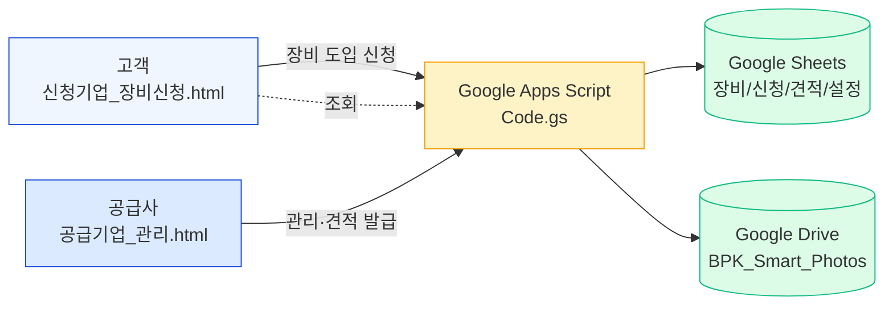
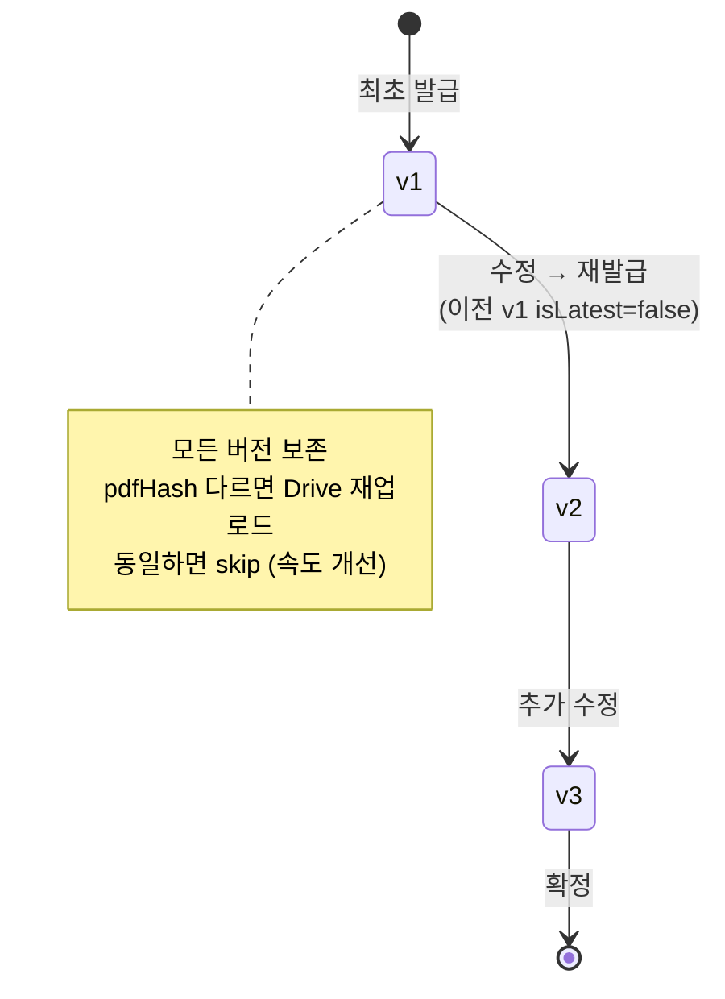

# BPK Smart 2026 — 개발 노트

> **작성일** 2026-05-07
> **프로젝트** BPK Smart 2026 — 식품 포장기계 견적 매칭 SPA
> **저장소** [github.com/bpksmart26/bpksmart2026](https://github.com/bpksmart26/bpksmart2026)
> **개발자** SeonjeCho · 2026 스마트제조 지원사업 (주)비피케이

---

## 0. 문서 사용법

이 노트는 **다시 시작할 때 첫 화면처럼 읽고** 곧바로 개발에 복귀할 수 있도록 만들었습니다.

| 목적 | 읽을 섹션 |
|---|---|
| 프로젝트가 뭐 하는지 빠르게 파악 | §1 개요 · §2 아키텍처 |
| 폴더/파일 구조와 역할 | §3 디렉토리 |
| API · 데이터 모델 | §4 데이터 모델 · §5 API |
| UI 컴포넌트 디자인 시스템 | §6 디자인 시스템 |
| 신청업체 관리 페이지 (오늘 대대적 변경) | §7 신청업체 관리 |
| 견적/PDF/Drive 흐름 | §8 견적 시스템 |
| 알려진 이슈 · 향후 작업 | §9 향후 작업 |
| 배포·환경 | §10 배포 |

---

## 1. 프로젝트 개요

식품 가공·포장 장비를 도입하려는 **고객사**(=신청 기업)가 양식을 제출하면, **공급사**(BPK)가 자동 매칭된 장비 후보를 받아 **견적서 PDF**를 발급·관리하는 시스템입니다.



### 1.1 사용 기술

- **프론트엔드** Vanilla HTML / CSS / JS (프레임워크 없음, 정적 호스팅 가능)
- **백엔드** Google Apps Script (`Code.gs`) — 단일 `doPost` 진입점, action 라우팅
- **데이터베이스** Google Sheets (4개 시트: 장비 / 신청 / 견적 / 설정)
- **파일 저장** Google Drive (회사명 폴더 안에 사진·PDF 저장)
- **PDF 생성** html2canvas + jsPDF (브라우저에서 캡처 → PDF)
- **인증** localStorage 기반 단순 로그인 (관리자 1계정)

### 1.2 두 개의 SPA

| SPA | 파일 | 사용자 | 핵심 기능 |
|---|---|---|---|
| **고객 페이지** | `신청기업_장비신청.html` | 식품 제조사 | 신청서 작성·제출, 견적서 PDF 다운로드, 신청 현황 조회 |
| **공급사 페이지** | `공급기업_관리.html` | BPK 관리자 | 신청 관리, 견적서 작성/발급, 장비 마스터 관리, 대시보드 |

---

## 2. 시스템 아키텍처

### 2.1 전체 데이터 흐름

```mermaid
sequenceDiagram
    autonumber
    participant 고객 as 고객 (신청기업)
    participant 공급 as 공급사 (관리자)
    participant GAS as Apps Script
    participant 시트 as Sheets
    participant 드라 as Drive

    고객->>GAS: saveApplication(신청서)
    GAS->>드라: 사진 업로드 (회사명 폴더)
    GAS->>시트: 신청 행 추가 (contentHash 포함)
    공급->>GAS: getAllData()
    GAS->>시트: 장비/신청/견적/설정 read
    GAS-->>공급: SWR 캐시
    공급->>GAS: saveQuoteWithVersion(견적)
    GAS->>시트: 이전 v.isLatest=false → 새 v + isLatest=true
    공급->>고객: 견적서 PDF 발급 알림
    고객->>GAS: getLatestQuotePdf({appId, includeBase64:true})
    GAS->>드라: 회사 폴더에서 BPK_견적서_*.pdf 검색
    GAS-->>고객: data:application/pdf;base64,...
    고객->>고객: blob → URL.createObjectURL → <a download>
```

### 2.2 SWR (Stale-While-Revalidate) 패턴

페이지 진입 시:

1. **즉시 표시** — `localStorage` 캐시(`SK.EQ`/`SK.APP`/`SK.QT`)에서 데이터 로드 → `renderApps()` 즉시
2. **백그라운드 갱신** — `apiCall('getAllData')` 비동기 호출
3. **응답 도착 시** — `applications = res.data` 후 `renderApps()` 재호출 + LS 캐시 갱신

**효과**: 첫 화면 < 200ms, 데이터 신선도는 백그라운드로 보장.

---

## 3. 디렉토리 구조

```
bpksmart2026/
├── 신청기업_장비신청.html       # 고객 SPA (양식 제출, 조회)
├── 공급기업_관리.html           # 공급사 SPA (관리, 견적, 대시보드)
├── common.js                   # 공용 유틸 (그룹화/해시/사진 캐시)
├── api.js                      # apiCall 래퍼, 사진 업로드, 토스트
├── config.js                   # APPS_SCRIPT_URL, API_ENABLED 등
├── eq_default.js               # 장비 60종 기본 시드
├── jikin.js                    # 직인 데이터 (PDF 서명용)
├── apps_script/
│   └── Code.gs                 # GAS 백엔드 (단일 진입 doPost)
├── 견적서 샘플/                  # 견적서 디자인 레퍼런스
├── tools/                      # 유틸리티 스크립트
├── docs/
│   └── dev-notes/              # 이 문서가 위치한 폴더
│       └── 2026-05-07_*.md
├── PROBLEMS.md                 # 초기 발견 이슈 모음
├── FIXES.md                    # 적용 수정 사항
├── PROJECT_STATUS.md           # 진행 상태 트래커
└── README_TEST.md              # 로컬 테스트 가이드
```

### 3.1 파일별 역할 요약

| 파일 | 라인 수 (대략) | 핵심 책임 |
|---|---|---|
| `공급기업_관리.html` | ~2,700 | 공급사 SPA · 메트릭바 · 알림카드 · 신청테이블 · 견적 발급 모달 · 대시보드 |
| `신청기업_장비신청.html` | ~2,400 | 고객 SPA · 4단계 양식 · 매칭 결과 · 견적 PDF 다운로드 |
| `common.js` | ~370 | `groupAppsByBizno` · `appContentHash` · `quoteHash` · 사진 캐시 |
| `api.js` | ~120 | `apiCall(action, data)` · `apiUploadPhotos` · `showToast` |
| `apps_script/Code.gs` | ~800 | 단일 `doPost` 라우터 · 12+ 액션 · LockService · CacheService |

---

## 4. 데이터 모델

### 4.1 Google Sheets — 4개 시트

#### `장비` 시트 (`EQ_COLS`)
```
id | name | model | category | price | photos[] | status | tags | createdAt
```

#### `신청` 시트 (`APP_COLS`)
```
id | bizno | company | manager | phone | email | addr |
pname | texture | processes[] | pkgtypes[] | speed |
equipment[] | status | date | memo | photos | contentHash
```
- `contentHash` — `bizno + JSON(content)`의 MD5 16자. 같은 회사 동일 신청 여부 판별
- `equipment[]` — 매칭된 장비 ID 배열

#### `견적` 시트 (`QT_COLS`)
```
id | appId | bizno | company | items[] | total | status |
date | createdAt | updatedAt | pdfUrl | pdfHash |
equipPdfUrl | equipPdfHash | version | isLatest | memo
```
- `version` — 1, 2, 3... (재발급 시 +1)
- `isLatest` — 같은 appId 내 최신 1건만 `true`
- `pdfHash` — 콘텐츠 해시. 동일하면 Drive 재업로드 skip

#### `설정` 시트
- `top_per_proc` — 공정별 추천 장비 수
- 기타 매칭 가중치

### 4.2 클라이언트 객체 schema

**Application** (`applications[]` 배열의 단일 항목)
```js
{
  id: 'NO-260507-8006',
  bizno: '275-88-01197',
  company: '한국소스주식회사',
  manager: '최소담', phone: '010-3333-4444',
  pname: '고추장', processes: ['포장','검사'],
  equipment: [12, 47],   // 장비 ID 배열
  status: '신청접수',     // | 검토중 | 수정중 | 확정 | 반려
  date: '2026-05-07 09:47',
  contentHash: '...16자hex'
}
```

**Quote** (`quotes[]`)
```js
{
  id: 'QT-...', appId: 'NO-...', bizno, company,
  items: [{eqId, qty, unit, price}, ...],
  total: 12345000,
  version: 2, isLatest: true,
  pdfUrl, pdfHash, equipPdfUrl, equipPdfHash,
  date, createdAt, updatedAt
}
```

---

## 5. API 엔드포인트 (Apps Script)

| Action | 데이터 | 응답 |
|---|---|---|
| `ping` | — | `{ok, time}` 헬스체크 |
| `getAllData` | — | `{equipment, applications, quotes, config}` 일괄 |
| `saveApplication` | Application 객체 | `{ok, id, contentHash}` |
| `bulkSaveEq` | Equipment 배열 | `{ok, count}` |
| `saveQuoteWithVersion` | Quote (version 자동 계산) | `{ok, id, version}` |
| `getLatestQuotePdf` | `{appId, bizno, includeBase64}` | `{ok, url, base64?}` 회사 폴더에서 최신 PDF |
| `uploadPhoto` | `{base64, name, type, company, eqName}` | `{ok, url}` |
| `deleteApps` | `{ids: [...]}` | `{ok, deleted}` 중복 정리 |
| `dedupePhotoFolders` | `{bizno?}` | `{ok, removed}` Drive 폴더 정리 |
| `migrateAppContentHash` | — | 기존 신청에 contentHash 채움 |
| `migrateQuoteVersions` | — | 견적에 version/isLatest 채움 |

### 5.1 LockService + CacheService

```js
function getOrCreateFolder(name, parentId) {
  const cacheKey = `folder:${parentId}:${name}`;
  const cached = CacheService.getScriptCache().get(cacheKey);
  if (cached) {
    const f = DriveApp.getFolderById(cached);
    if (!f.isTrashed()) return f;  // 휴지통 폴더는 무시
  }
  const lock = LockService.getScriptLock();
  lock.waitLock(10000);
  try {
    // 검색 → 없으면 생성 → 캐시
  } finally { lock.releaseLock(); }
}
```

**왜?** Drive 검색 인덱스 lag로 동시 요청 시 같은 회사 폴더가 2개씩 만들어지던 버그를 막기 위함. 캐시는 6시간 TTL.

---

## 6. 디자인 시스템

### 6.1 색상 변수 (`:root`)

```css
--primary: #1d4ed8;   --primary-h: #1e40af;
--primary-l: #dbeafe; --primary-50: #eff6ff;
--accent: #10b981;    --accent-50: #d1fae5;
--orange: #f59e0b;    --orange-l: #fef3c7;
--g50…--g900           /* Slate gray scale */
```

### 6.2 컴포넌트

| 컴포넌트 | 클래스 | 위치 |
|---|---|---|
| 메트릭 박스 (3개 독립) | `.metric-bar > .metric` | 신청업체 관리 상단 |
| 알림 카드 (풀폭 + 칩 wrap) | `.alert-card .alert-list .alert-chip` | 신청업체 관리 |
| 차트 row (공정/물품) | `.chart-row .chart-ic .chart-bar` | 대시보드 |
| 메인 카드 | `.card .card-hdr .toolbar` | 모든 섹션 |
| 상태 배지 | `.badge .b-new/.b-ok/.b-rej...` | 테이블, 모달 |
| 리사이저 핸들 | `.col-resizer` | 신청 테이블 헤더 |

### 6.3 아이콘

**모두 단색 SVG `<symbol>` + `<use>` 패턴** (currentColor 상속)
- `i-inbox`, `i-mail`, `i-check`, `i-clock`, `i-clipboard`, `i-document`
- `i-scale`, `i-truck`, `i-package`, `i-bottle`, `i-tag`, `i-search`, `i-tornado`, `i-shape`, `i-cube`
- `i-edit`, `i-x`, `i-trash`, `i-download`, `i-eye`, `i-refresh`, `i-tool`, `i-factory`, `i-money`, `i-trending-up`

```html
<svg class="ic"><use href="#i-inbox"/></svg>
```

색은 부모의 `color` CSS로 결정 → 컬러 이모지 없이 일관된 톤 유지.

### 6.4 레이아웃 안전망

```css
.main-wrap { overflow-x: hidden; min-width: 0 }
.content   { box-sizing: border-box; min-width: 0; max-width: 100% }
.metric-bar, .alert-card, .card { box-sizing: border-box; min-width: 0; max-width: 100% }
```

flex/grid 자식의 기본 `min-width: auto` 때문에 자식 콘텐츠가 부모를 밀어내는 현상 차단.

---

## 7. 신청업체 관리 페이지 — 핵심 변경 이력

오늘(2026-05-07) 대시보드 영역을 거의 처음부터 재설계했습니다.

### 7.1 변경 전후 구조 비교

**변경 전 (4박스 grid 1fr 1fr 1fr 1.7fr)**
```
[전체신청] [신규] [확정완료] [검토수정중] (한 행 4박스, 기능 검토수정중은 의미 약함)
[──────── 신청업체 목록 (테이블, table-layout:auto) ────────]
```

**변경 후 (메트릭바 + 알림카드 + 테이블)**
```
[전체신청 (독립박스)] [신규(미확인) (독립박스)] [확정완료 (독립박스)]   ← 메트릭바, 클릭 필터
[━━━ 중복/변경 알림 (풀폭) [중복N] [변경M]   회사칩 가로 wrap ━━━]
[──────── 신청업체 목록 (table-layout:fixed, 한줄강제, 컬럼리사이저) ────────]
```

### 7.2 메트릭바 — 클릭 필터 + 3줄 수직 스택

```html
<div class="metric-bar">
  <div class="metric active" data-stfilter="" onclick="setStatFilter('')">
    <div class="metric-ic"><svg><use href="#i-inbox"/></svg></div>
    <div class="metric-text">
      <div class="metric-label">전체 신청</div>
      <div class="metric-value" id="st-total">0</div>
      <div class="metric-sub">누적 접수</div>
    </div>
  </div>
  <!-- 신규(미확인) status='신청접수' -->
  <!-- 확정완료 status='확정' -->
</div>
```

**핵심 CSS**
```css
.metric-bar { display:grid; grid-template-columns:repeat(3,1fr); gap:14px }
.metric { padding:20px 24px; min-height:104px;
          background:#fff; border:1px solid var(--g200);
          border-radius:var(--r); box-shadow:var(--sh) }
.metric:hover  { transform:translateY(-2px); box-shadow:0 6px 20px rgba(15,23,42,.08) }
.metric.active { background:#f5f8ff; border-color:var(--primary-l) }
.metric.active::after { content:''; position:absolute; left:0; right:0;
                        bottom:0; height:3px; background:var(--primary) }
.metric-text  { display:flex; flex-direction:column; justify-content:center; gap:5px }
.metric-value { font-size:28px; font-weight:800; font-family:'JetBrains Mono',monospace }
```

**클릭 필터 동작**
```js
function setStatFilter(v) {
  appSt = v;
  document.getElementById('app-status-filter').value = v;
  renderApps();
}
// renderApps() 내부에서
document.querySelectorAll('.metric[data-stfilter]').forEach(c => {
  c.classList.toggle('active', c.dataset.stfilter === appSt);
});
```

### 7.3 중복/변경 알림 카드 — 회사 칩 가로 wrap

`groupAppsByBizno(applications)` → 각 그룹의 `hasDuplicates`/`hasChanges`로 회사 분류.

| 카테고리 | 정의 | 칩 dot 색 |
|---|---|---|
| **중복만** | 같은 contentHash 2건 이상 | 🟢 accent (초록) |
| **변경만** | 서로 다른 contentHash 2건 이상 | 🟠 orange (주황) |
| **둘다** | 두 조건 모두 | 🟣 #a855f7 (보라) |

```html
<div class="alert-card">
  <div class="alert-hdr">
    <span class="alert-hdr-ic"><svg><use href="#i-clock"/></svg></span>
    <span class="alert-title">중복 / 변경 알림</span>
    <span class="alert-counts">
      <span class="pill dup"><span class="n">N</span><span class="l">중복</span></span>
      <span class="pill chg"><span class="n">M</span><span class="l">변경</span></span>
    </span>
  </div>
  <div class="alert-list">
    <!-- 칩 가로 wrap -->
    <div class="alert-chip both">
      <span class="dot"></span>
      <svg class="ic-c"><use href="#i-clipboard"/></svg>
      <span class="nm">(주)김치공방</span>
      <span class="sep"></span>
      <span class="tg dup">중복<span class="n">2</span></span>
      <span class="sep"></span>
      <span class="tg chg">변경<span class="n">2</span></span>
    </div>
    <!-- … -->
  </div>
</div>
```

**칩 디자인 핵심**
- 좌측 7px 컬러 dot으로 카테고리 즉시 식별
- 회사명과 카운트 사이 vertical divider (`<span class="sep"></span>`)
- 숫자만 컬러(accent/orange) 강조, 라벨은 회색
- max-height 160px → 회사 많아지면 내부 스크롤

### 7.4 신청업체 목록 — 한 줄 강제 + 컬럼 리사이저

**기업명 컬럼 제거** (그룹 헤더에 회사명 이미 있음 → 중복)

```html
<table id="app-table">
  <colgroup>
    <col data-key="recv"  style="width:170px">  <!-- 접수번호 + [최신/중복] 배지 -->
    <col data-key="mgr"   style="width:90px">
    <col data-key="phone" style="width:140px">
    <col data-key="prod"  style="width:155px">
    <col data-key="proc"  style="width:160px">
    <col data-key="eq"    style="width:240px">
    <col data-key="stat"  style="width:115px">
    <col data-key="date"  style="width:150px">
    <col data-key="act"   style="width:180px">
  </colgroup>
  <thead><tr>
    <th>접수번호</th><th>담당자</th><th>연락처</th>
    <th>제품</th><th>희망 공정</th><th>선택 장비</th>
    <th>상태</th><th>접수일</th><th>관리</th>
  </tr></thead>
  <tbody id="app-tbody"></tbody>
</table>
```

**한 줄 강제**
```css
#sec-applications table { table-layout:fixed; width:100% }
#sec-applications tbody tr:not(.grp-hdr-row) td {
  white-space:nowrap; overflow:hidden; text-overflow:ellipsis
}
```

**컬럼 리사이저**
```js
function _initColResizers() {
  const handle = document.createElement('span');
  handle.className = 'col-resizer';
  handle.addEventListener('mousedown', (e) => {
    const startX = e.clientX, startW = col.offsetWidth;
    const onMove = (ev) => {
      col.style.width = Math.max(60, startW + (ev.clientX - startX)) + 'px';
    };
    document.addEventListener('mousemove', onMove);
    document.addEventListener('mouseup', () => {
      document.removeEventListener('mousemove', onMove);
      _saveColWidths();   // localStorage 저장
    });
  });
  // 더블클릭 → 해당 컬럼 LS 키 삭제 → 새로고침 시 기본 복귀
}
```

저장 키: `bpk_app_col_widths_v1`

### 7.5 그룹 헤더 (회사별 집계 행)

```html
<tr class="grp-hdr-row" onclick="toggleAppGroup('grp-...')">
  <td colspan="9">
    <svg class="ic"><use href="#i-clipboard"/></svg>
    <span class="fw">(주)김치공방</span>
    <span>3건</span>
    <span class="badge b-rej">중복 2건</span>
    <span class="badge b-mod">변경 1건</span>
    <button>중복 정리</button>
    <button>비교</button>
  </td>
</tr>
```

펼침 상태는 `_expandedGroups: Set<groupId>`로 관리, 재렌더 시 유지.

### 7.6 대시보드 차트 — 공정 10종 + 물품 TOP 5

**공정 정의는 신청 폼(`신청기업_장비신청.html:845-854`)과 동기화 필수**

```js
const PROC_LIST = [
  {key:'계량',   label:'계량',       icon:'i-scale'},
  {key:'이송',   label:'이송·공급',   icon:'i-truck'},
  {key:'포장',   label:'포장·밀봉',   icon:'i-package'},
  {key:'충진',   label:'충진·충전',   icon:'i-bottle'},
  {key:'라벨링', label:'라벨링',      icon:'i-tag'},
  {key:'검사',   label:'검사·선별',   icon:'i-search'},
  {key:'혼합',   label:'혼합·교반',   icon:'i-tornado'},
  {key:'성형',   label:'성형·분할',   icon:'i-shape'},
  {key:'테이핑', label:'테이핑',      icon:'i-cube'},
  {key:'제함',   label:'제함',        icon:'i-package'}
];
```

**렌더링 정책**
- 공정: **10개 모두 고정 표시** (0건도 회색)
- 물품: 상위 5개만, 1=골드/2=실버/3=브론즈/4·5=회색
- 카드 헤더에 요약 표시 (`활성 공정 N/10 · 총 선택 M건`)

**공통 row 구조** (`.chart-row`)
```html
<div class="chart-row">
  <div class="chart-ic gold"><svg><use href="#i-package"/></svg></div>
  <div class="chart-info">
    <div class="chart-name-row">
      <span class="chart-name">포장·밀봉</span>
      <span class="chart-count">8<small>건</small></span>
    </div>
    <div class="chart-bar"><div class="chart-bar-fill gold" style="width:75%"></div></div>
  </div>
</div>
```

> 📋 **카운팅 정책 (현재)** — 모든 신청을 raw 카운트. 향후 `'확정'만`/`회사별 unique`/`최신 버전만`으로 전환할지 검토 필요.

---

## 8. 견적 시스템

### 8.1 버전 관리



### 8.2 PDF 다운로드 (Cross-Origin 해결)

**문제**: 고객 페이지에서 Drive `<a download>` 클릭해도 새 탭 열기만 됨 (cross-origin)

**해결**:
```js
// GAS 측 — base64 인코딩된 데이터를 함께 반환
getLatestQuotePdf({appId, includeBase64: true})
  → { ok: true, url: '...', base64: 'JVBERi0xLjQK...' }

// 클라이언트 측
const blob = b64toBlob(res.base64, 'application/pdf');
const url = URL.createObjectURL(blob);
const a = document.createElement('a');
a.href = url; a.download = `BPK_견적서_${company}.pdf`;
a.click();
```

### 8.3 같은 회사 다중 appId 처리

같은 회사가 여러 신청을 했고 그 중 일부에만 견적이 발급된 경우:
1. `apps.filter(a => a.bizno === bizno).sort(date DESC)` → 최신 신청
2. 그 appId에 견적이 없으면 → **회사 폴더 전체에서 BPK_견적서_*.pdf 중 최신 시간순** fallback

---

## 9. 향후 작업 / 알려진 이슈

### 9.1 단기 (다음 세션)

- [ ] **카운팅 정책 결정** — 물품 빈도 차트의 raw vs 확정만 vs unique
- [ ] **메트릭바 모바일 대응** — 현재 grid 3컬럼 고정, 좁은 화면에서 줄바꿈 필요
- [ ] **알림 칩 클릭 필터 연동** — 회사명 클릭 시 신청 테이블에서 해당 회사로 필터링하면 UX↑

### 9.2 중장기

- [ ] 공정 10종 정의를 별도 JSON/JS 파일로 분리 → 고객·관리자 페이지 양쪽에서 import (SSOT)
- [ ] 견적 발급 후 자동 이메일 알림 (Apps Script `MailApp`)
- [ ] 신청서 buyer 단 PDF 미리보기 (현재는 견적서만)
- [ ] 검토중/수정중 상태 활용 워크플로우 재정의

### 9.3 보안 / 운영

- ⚠️ `config.js`의 `APPS_SCRIPT_URL`은 공개 가능한 web app URL. 인증은 LockService + 단순 password에 의존 → 민감 거래 데이터 추가 시 OAuth 도입 필요
- ⚠️ Drive 폴더 권한이 "링크 가진 모든 사용자"로 설정되어 있음 → 최소 권한 점검 필요

---

## 10. 배포 / 환경

### 10.1 로컬 실행

```bash
# 어떤 정적 서버든 사용 가능
cd ~/Projects/bpksmart2026
python3 -m http.server 8080
# → http://localhost:8080/공급기업_관리.html
# → http://localhost:8080/신청기업_장비신청.html
```

### 10.2 Apps Script 배포

1. Google Drive → Apps Script 새 프로젝트
2. `apps_script/Code.gs` 내용 복사
3. **배포 → 새 배포** → 유형 `웹 앱`
4. **다음 사용자로 실행**: 본인
5. **액세스 권한**: 모든 사용자
6. 배포 URL 복사 → `config.js`의 `APPS_SCRIPT_URL`에 붙여넣기

### 10.3 정적 호스팅 옵션

- **GitHub Pages** (선택) — 무료, push만 하면 자동 배포
- **Netlify / Vercel** — drag & drop 또는 GitHub 연동
- **Firebase Hosting** — Google 친화적

### 10.4 환경 변수 / 시크릿

`config.js`는 git에 포함되지만 URL 자체가 비공개 토큰처럼 작동하므로 GAS deploy 시 access를 "본인만"으로 제한하면 다른 시스템에서 호출 불가.

---

## 11. 변경 이력 (오늘 세션 압축)

| 시각 | 영역 | 변경 |
|---|---|---|
| 초반 | repo | GitHub 클론 + 코드 분석 → `PROBLEMS.md`/`FIXES.md` 생성 |
| | 성능 | T1 최적화 — SWR 캐시 + 사진 prefetch + 폴더 캐시 |
| | dedup | bizno + contentHash 기반 회사별 그룹화 + 중복정리 모달 |
| | 견적 | version/isLatest 도입, PDF 동일 콘텐츠 skip 업로드 |
| | PDF | base64 cross-origin 해결, 다중 appId 시 회사폴더 최신 fallback |
| | 디자인 | 단색 SVG 아이콘 시스템, 컬러 톤다운, 사이드바 라이트 |
| | 신청 폼 | 섹션 헤더 카운터 자동번호, 헤더 로고 통일 |
| 오늘 | 신청업체 관리 | 4박스 → 메트릭바 3박스(독립) + 알림카드(풀폭) 분리 |
| | | 알림 칩에 카테고리 dot 컬러 분류 + vertical divider |
| | | 신청 테이블 한 줄 강제 + 컬럼 리사이저 (LS 저장) |
| | | 기업명 컬럼 제거 ([최신/중복] 배지는 접수번호 우측으로) |
| | 대시보드 | 공정 10종 고정 표시 + 물품 TOP 5 순위 강조 |

---

## 12. 빠른 점검 체크리스트

새로운 환경에서 시작할 때 확인할 항목:

```
□ git clone https://github.com/bpksmart26/bpksmart2026.git
□ config.js 의 APPS_SCRIPT_URL 이 유효한지 ping 테스트
□ Apps Script 시트 ID/폴더 ID 가 본인 계정으로 접근 가능한지
□ 로컬 서버 (python -m http.server 등) 띄우고 두 페이지 모두 로드 OK
□ 신청서 한 건 제출해서 Drive 폴더 + 사진 + Sheets 행 모두 생성 확인
□ 공급기업 페이지에서 그 신청을 받아 견적서 v1 발급 → PDF 다운로드 OK
□ 같은 신청에 v2 발급 → isLatest 토글 + 회사 폴더에서 최신 PDF 정상 반환
```

---

## 부록 A. 주요 함수 빠른 인덱스

| 함수 | 위치 | 역할 |
|---|---|---|
| `groupAppsByBizno` | `common.js:309` | 신청 배열 → 회사별 그룹 |
| `appContentHash` | `common.js` | 신청 내용 16자 해시 |
| `_renderAppGroup` / `_renderAppRow` | `공급기업_관리.html` | 테이블 그룹/자식 행 |
| `setStatFilter` | `공급기업_관리.html:1187` | 메트릭바 클릭 필터 |
| `_renderStatAlert` | `공급기업_관리.html` | 알림 카드 회사 칩 렌더 |
| `_initColResizers` | `공급기업_관리.html` | 컬럼 폭 드래그 |
| `renderDashboard` | `공급기업_관리.html` | 대시보드 차트 |
| `saveQuoteWithVersion` | `apps_script/Code.gs` | 견적 v+1 + isLatest 갱신 |
| `getLatestQuotePdf` | `apps_script/Code.gs` | 회사 폴더 최신 PDF + base64 |
| `getOrCreateFolder` | `apps_script/Code.gs` | LockService + CacheService 폴더 |

---

## 부록 B. 트러블슈팅 노트

| 증상 | 원인 | 해결 |
|---|---|---|
| Drive 폴더가 회사당 2개씩 생김 | 동시 검색 시 인덱스 lag | `LockService` + `CacheService` |
| 캐시 폴더가 휴지통 가리킴 | dedupe 후 캐시 무효화 누락 | `isTrashed()` 확인 후 무시 |
| 견적 v2 PDF가 다운로드되지 않음 | cross-origin `<a download>` | `includeBase64:true` → blob URL |
| 같은 회사 신청 여러 개 → 잘못된 PDF | `apps.find` (첫 번째 반환) | filter+sort 후 [0], 회사 폴더 fallback |
| 신청업체 목록 행이 wrap | `table-layout: auto` 기본값 | `fixed` + `colgroup` + `nowrap`/ellipsis |
| 메트릭바 일부 잘림 | flex 자식 `min-width: auto` | `min-width: 0` + `overflow-x: hidden` |
| 알림 카드 회사 100+ | max-height 없음 | `max-height: 160px` + scroll |

---

**노트 작성 완료. 다음 세션에서는 §9 향후 작업의 단기 항목부터 진행하면 효율적입니다.**

— *Drafted by Claude · Reviewed for: SeonjeCho · 2026-05-07*
