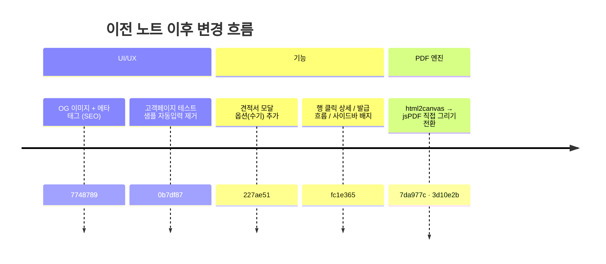
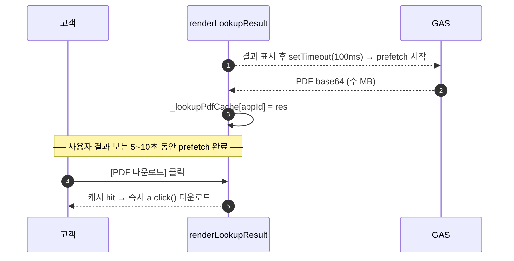
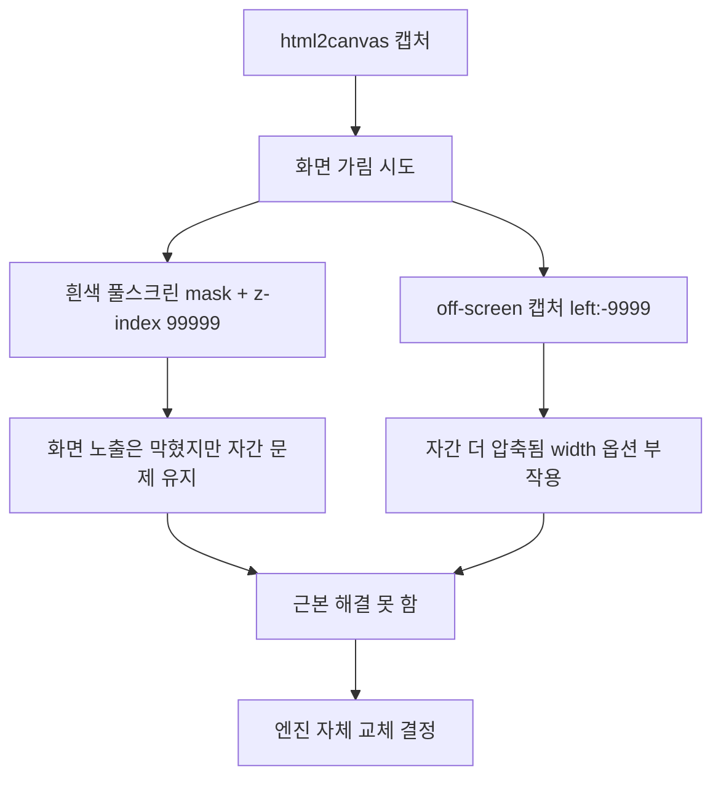
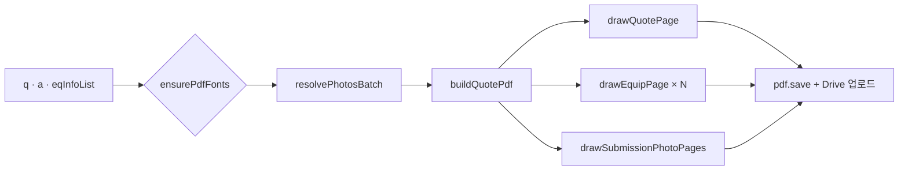

# BPK Smart 2026 — 개발 노트 (PDF 엔진 전환 + 기능 정리)

> **작성일** 2026-05-07 (이전 노트 직후, 같은 날 후반 작업분)
> **이전 노트** [2026-05-07_BPK_Smart_2026_개발노트.md](./2026-05-07_BPK_Smart_2026_개발노트.md)
> **커밋 범위** `4598457` (이전 노트 작성 시점) → `3d10e2b` (jsPDF 머지)
> **주제** ① OG/SEO ② 테스트 샘플 제거 ③ 견적서 옵션·발급 흐름 ④ 행 클릭 상세 ⑤ 알림 카드 칩 디자인 ⑥ **PDF 엔진 html2canvas → jsPDF 직접 그리기 전환** ⑦ 신청 사진 페이지

---

## 0. 한눈에 보기

이번 라운드의 핵심은 **PDF 생성 엔진 전체를 html2canvas → jsPDF 직접 그리기로 전환**한 것입니다. 한자/한글-영문-숫자-특수문자 자간 압축, 화면 깜빡임, 큰 PDF 사이즈를 한 번에 해결했습니다. 부가적으로 견적서 모달에 옵션(수기 입력)을 추가하고, 견적서·물품 목록의 행 클릭 상세 모달을 만들고, 발급 흐름을 단순화(자동 PDF 생성)했습니다.



---

## 1. OG / SEO (커밋 `7748789`)

### 1.1 추가 산출물

| 파일 | 내용 |
|---|---|
| `assets/og-image.png` | 1200×630 PNG · BPK 헥사고 로고 + "BPK Smart 2026" 브랜드 + 부제 + 회사명 |
| `tools/og-source.html` | Chrome headless로 PNG 렌더링한 디자인 소스 (재생성 시 사용) |
| `공급기업_관리.html` `<head>` | OG / Twitter Card 메타 태그 11개 |
| `신청기업_장비신청.html` `<head>` | 동일 메타 태그 (페이지별 og:title / og:description 다름) |

### 1.2 메타 태그 구성

```html
<meta name="description" content="…">
<meta property="og:type" content="website">
<meta property="og:site_name" content="BPK Smart 2026">
<meta property="og:locale" content="ko_KR">
<meta property="og:url" content="https://bpksmart26.github.io/bpksmart2026/...">
<meta property="og:title" content="BPK Smart 2026 — 공급사 관리 / 장비 도입 신청">
<meta property="og:description" content="…">
<meta property="og:image" content="…/assets/og-image.png">
<meta property="og:image:type" content="image/png">
<meta property="og:image:width" content="1200">
<meta property="og:image:height" content="630">
<meta property="og:image:alt" content="…">
<meta name="twitter:card" content="summary_large_image">
<!-- twitter:title / description / image -->
```

### 1.3 OG 이미지 디자인

- 좌측: BPK 헥사고 로고 (주황·노랑 그라디언트, drop-shadow)
- 우측: `2026 스마트제조 지원사업` 배지 → `BPK Smart 2026` 큰 타이틀 (`Smart`만 그라디언트 포인트) → 부제 → `Best Pack Korea · (주)비피케이`
- 배경: 옅은 파랑·주황 코너 글로우 + 데코 헥사고 2개

### 1.4 캐시 갱신 도구 (사용자에게 공유한 정보)

| 플랫폼 | URL |
|---|---|
| 카카오톡 | https://developers.kakao.com/tool/clear/og |
| 페이스북 | https://developers.facebook.com/tools/debug/ |
| 트위터/X | https://cards-dev.twitter.com/validator |
| 링크드인 | https://www.linkedin.com/post-inspector/ |

---

## 2. 신청 폼 — 테스트 샘플 자동입력 제거 (커밋 `0b7df87`)

QA 도구로 추가됐던 5개 회사 자동입력 박스를 운영 페이지에서 완전 제거.

| 영역 | 제거 내용 | 라인 수 |
|---|---|---|
| CSS | `.sample-bar` / `.sample-label` / `.sample-btn` | 5 |
| HTML | 기업 정보 입력 패널 상단의 sample-bar 박스 | 9 |
| JS | `SAMPLE_COMPANIES` 배열 + `fillSample()` 함수 | 29 |

**검증** — `grep -c "sample-bar|fillSample|SAMPLE_COMPANIES|테스트 샘플"` = 0건.

---

## 3. 견적서 모달 — 옵션(수기 입력) (커밋 `227ae51`)

### 3.1 배경

견적 항목(등록 물품 select) 외에 운반·설치비, 추가 노즐 등 **공급사가 직접 입력하는 옵션 항목**이 필요했음. 데이터·UI·PDF 모두 새로 설계.

### 3.2 시트 컬럼 추가 (`apps_script/Code.gs`)

```js
const QT_COLS = ['id','company','appId','process','memo','validUntil',
                 'items','options','total','eqCount','status','date',
                 'pdfUrl','equipPdfUrl','pdfHash','equipPdfHash',
                 'version','isLatest'];        // ← items 다음에 'options' 추가
const QT_ARR  = ['items','options'];           // ← 배열 직렬화 대상
```

**주의** — GAS 재배포 필요 (사용자 액션). 미배포 시 클라이언트는 options를 보내지만 시트엔 마지막 컬럼에 임시 저장됨.

### 3.3 모달 UI

```
[견적 항목]   드롭박스(flex:3) | 수량(64px) | 자동합계(flex:1.2) | 삭제
              + 항목 추가

[옵션 / 추가 사양]   옵션명(flex:3) | 수량(64px) | 금액(flex:1.2) | 삭제
                    + 옵션 추가     ← 견적 항목과 정확히 같은 폭
```

폭이 견적 항목과 일치하도록 단위(SET) 입력 칸·자동 합계 표시 칸 모두 제거. **단위는 무조건 SET 자동 적용**.

### 3.4 옵션 가격 정책 — 수량 곱셈 없음

옵션의 가격 입력은 **그 옵션의 합계 금액**으로 간주. 수량은 PDF의 수량 컬럼 표시용으로만 사용.

| 위치 | 처리 |
|---|---|
| 모달 합계 (`calcQTotal`) | `total += op.price` (qty 곱셈 X) |
| 시트 `total` 컬럼 (`getQData`) | 동일 |
| PDF 옵션 행 합계 칸 | `op.price` 그대로 표시 |
| PDF 옵션 행 수량 칸 | `op.qty` 그대로 표시 |

**입력 예시:** 옵션명 "추가 노즐 세트", 수량 3, 금액 500,000 → PDF에 "수량 3 / SET / 500,000원" (1,500,000원 아님)

### 3.5 PDF 옵션 표시

견적 항목 표 안에 같이 들어가되 라벨로 구분: **`[옵션]옵션명`** (배경·색 없는 단순 텍스트). 단위는 SET 고정.

### 3.6 신청 현황 조회 (고객 페이지)에도 옵션 표시

`renderLookupResult` 함수에 옵션 섹션 추가:

```
도입 장비 (3개)        견적서 v2 기준
─────────────────────
액상류 자동충진수직사면포장기   18,000,000원
…

추가 옵션 (2개)                    ← 신규 섹션
─────────────────────
[옵션] 추가 노즐 세트 × 3      500,000원
[옵션] 운반·설치비             1,200,000원

총 예상 금액 (VAT 별도)     37,700,000원
```

---

## 4. PDF 발급 흐름 단순화 + 견적서 관리 버튼 정리 (커밋 `fc1e365` 일부)

### 4.1 모달 footer 버튼 라벨 동적 변경

| 진입 컨텍스트 | 모달 타이틀 | 버튼 라벨 |
|---|---|---|
| 신규 (qtId 없음) | `견적서 작성 — {회사}` | **`견적서 발급`** |
| 재발급 (qtId 있음) | `견적서 수정 — {회사}` | **`견적서 재발급`** |

### 4.2 sendQuote 끝에서 genPDF 자동 호출

```js
async function sendQuote() {
  // … 기존 데이터 저장, syncQt …
  showToast(`${d.company} 견적서 v${newVersion} 확정 — PDF 생성 중...`);
  try {
    await genPDF(qt.id);   // ← 추가: 즉시 다운로드 + Drive 업로드
  } catch(e) { … }
}
```

**효과** — 사용자가 별도 [PDF] 버튼을 누를 필요 없이 발급과 동시에 PDF 생성·다운로드·Drive 백업이 자동 진행.

### 4.3 견적서 관리 행 액션 버튼 정리

| 이전 | 이후 |
|---|---|
| `[수정] [확정?] [장비PDF] [☁ Drive열기] [버전(N)?]` | **`[수정]` `[버전(N)]`** 두 개 (항상 표시) |

- `[PDF]` 버튼 삭제 (sendQuote 자동화로 불필요)
- 구름 아이콘 (`☁ Drive 열기`) 삭제 (히스토리 모달과 기능 중복)
- `[확정]` 버튼 삭제 (sendQuote가 자동 확정 처리)
- `[장비PDF]` 버튼 → 버전 모달의 PDF 컬럼으로 이동
- `[버전(N)]` — 버전이 1개여도 항상 표시

### 4.4 버전 히스토리 모달 PDF 컬럼

| 이전 | 이후 |
|---|---|
| `[☁ 견적] [☁ 장비]` (Drive 새 탭 열기) | **`[견적] [장비]`** 다운로드 버튼 (`genPDF` / `genEquipPDF` 직접 호출) |

각 버전마다 `q.pdfUrl` 있으면 옆에 작은 ✓ 아이콘으로 발급 상태 표시.

---

## 5. 행 클릭 상세 모달 (커밋 `fc1e365`)

신청업체 모달처럼 견적서·물품도 **행 어디든 클릭 → 상세 모달** 진입.

### 5.1 견적서 상세 모달 (`#modal-qt-detail`)

진입: `<tr onclick="openQuoteDetail(qtId)">`

내용:
- 상태/버전 배지 + 최신 표시
- 기본 정보: 업체명 / 접수번호 / 사업자번호 / 담당자 / 공정 / 버전·발급일
- 견적 항목 표 (옵션은 같은 표 안에 [옵션] 라벨로 합쳐서 표시)
- 합계 금액 박스
- 비고(있을 때만 노란색 강조)
- PDF 링크: 견적서 / 장비 사양서 (Drive 발급된 게 있으면 "Drive에서 보기 ↗")
- footer 버튼: [닫기] [버전 히스토리] [수정]

### 5.2 공급물품 상세 모달 (`#modal-prod-detail`)

진입: `<tr onclick="openProdDetail(eqId)">`

내용:
- 활성/비활성 배지 + 카테고리 배지
- 기본 정보: 물품명 / 모델 / 가격 / 상태 / 설명
- 사양 (Specifications) 7항목 (등록된 것만)
- 매칭 태그 (tag_texture / tag_pkg)
- 장비 사진 / 포장 사진 (가로 wrap, raw URL 직접 + onerror base64 fallback)
- footer 버튼: [닫기] [수정]

### 5.3 클릭 충돌 방지

행 안 액션 버튼 셀에 `event.stopPropagation()` 처리 → [수정], [버전(N)], [상세] 등 버튼만 클릭됐을 때 행 onclick이 트리거되지 않음.

---

## 6. 알림 카드 칩 디자인 (커밋 `fc1e365`)

이전 노트에서 만든 중복/변경 알림 카드의 회사 칩 디자인을 재차 정돈.

```
[● (주)김치공방 │ 중복 2 │ 변경 2]   ← 둘 다 (보라 dot)
[● 우리떡공방   │ 중복 2]            ← 중복만 (초록 dot)
[● 한국소스(주) │ 변경 2]            ← 변경만 (주황 dot)
```

| 요소 | 디자인 |
|---|---|
| 좌측 dot | 7px 컬러 + 흰색 외곽 ring (카테고리 즉시 식별) |
| 회사명·카운트 사이 | vertical divider 1px × 13px |
| 카운트끼리 | 동일 divider |
| 카운트 숫자 | monospace 13px / 800, 컬러(accent/orange) |
| 카운트 라벨 | 회색(g500), 작은 크기 |
| 칩 자체 | 흰 배경 + 옅은 외곽선 + 미세 그림자 |

헤더의 `[중복 N] [변경 M]` 통계 chip은 차분한 회색 배경 + 컬러 숫자 강조 (회사 row 태그와 시각 위계 차이 명확).

---

## 7. 사이드바 배지 (커밋 `fc1e365`)

| 항목 | 변경 |
|---|---|
| `신청 업체 관리` 배지 | `var(--danger)` 진한 빨강 + 흰 글자 → **옅은 빨강(#fee2e2) + 진한 빨강 글자(#b91c1c) + 옅은 외곽선** |
| `견적서 관리` 배지 | **DOM 자체 제거** + JS 참조 가드 |

---

## 8. 신청 상세 모달 사진 처리 (커밋 `fc1e365`)

이전 raw URL 직접 사용 + base64 prefetch 시도 → 사진이 깨지는 일부 케이스를 해결하기 위해 **onerror fallback** 패턴으로 정착.

```html

```

```js
async function _appPhotoErr(img) {
  if (img.dataset.fallbackTried) return;          // 무한 루프 방지
  img.dataset.fallbackTried = '1';
  const original = img.dataset.original || '';
  try {
    const resolved = await resolvePhoto(original); // GAS 경유 base64
    if (resolved) img.src = resolved;
    else _appPhotoFail(img, original);             // 실패 처리
  } catch(e) { _appPhotoFail(img, original); }
}
```

**효과**: 99%는 raw URL로 즉시 표시, 실패한 사진만 GAS 경유 복구. 양쪽 다 실패하면 빨강 박스 + 클릭 시 원본 새 탭.

---

## 9. 신청 현황 조회 — PDF prefetch (커밋 `fc1e365`)

다운로드 클릭 → 응답 대기 → 다운로드 시작까지 수 초 걸리던 문제 해결.



코드:
```js
const _lookupPdfCache = {};
const _lookupPdfInflight = {};
function _prefetchQuotePdf(app) {
  if (_lookupPdfCache[app.id]) return;
  if (_lookupPdfInflight[app.id]) return;
  _lookupPdfInflight[app.id] = true;
  apiCall('getLatestQuotePdf', { ... })
    .then(res => { if (res?.ok && res.base64) _lookupPdfCache[app.id] = res; })
    .finally(() => { delete _lookupPdfInflight[app.id]; });
}
```

`downloadPDF` 첫 줄: 캐시 hit → 즉시 다운로드 / inflight면 1.5초 대기 / 미스면 정식 fetch.

---

## 10. **PDF 엔진 전환 — html2canvas → jsPDF 직접 그리기** (커밋 `7da977c` · `3d10e2b`)

이번 세션의 핵심 작업. 이전 방식의 근본적 한계를 한 번에 해결.

### 10.1 문제 인식

| 이전 (html2canvas + jsPDF) | 증상 |
|---|---|
| HTML 템플릿 DOM → 화면 캡처 → 이미지 → PDF 첨부 | 한글-영문-숫자-특수문자 mix 시 자간 압축 |
| | PDF 사이즈 1~3 MB (이미지 기반) |
| | 캡처 직전 템플릿이 화면에 노출 (깜빡임) |
| | 텍스트 검색·복사 불가 |

### 10.2 시도한 회피책 (모두 한계)



### 10.3 새 방식 — jsPDF 좌표 기반 직접 그리기



### 10.4 폰트 — Source Han Sans Korean

| 시도 | 결과 |
|---|---|
| Google Fonts NanumGothic | ❌ 한자 0개 |
| Google Fonts NanumMyeongjo | ❌ 한자 0개 |
| jsdelivr Pretendard TTF | ❌ 404 (HTML 페이지를 받음) |
| GitHub notofonts/korean | ❌ 모든 URL 막힘 |
| KoPubWorld | ❌ 모든 URL 막힘 |
| **사용자가 직접 다운로드한 Source Han Sans Korean OTF** | ✅ 한자 8,139자 + 한글 11,172자 |

**처리 파이프라인:**
```
SourceHanSansKR-Regular.otf (4.6 MB)
  ↓ otf2ttf
SourceHanSansKR-Regular.ttf (5.9 MB)
  ↓ pyftsubset (한글 + 한자 + 라틴 + 기호만)
SourceHanSansKR-Regular-KR.ttf (4.7 MB)
  ↓ base64
assets/fonts/SourceHanSansKR-Regular-KR.js (6.2 MB)
```

Bold도 동일. 합계 ~12 MB JS 모듈. **첫 PDF 생성 시점에만 lazy load**, 이후 캐시.

### 10.5 코드 구조

| 파일 | 역할 |
|---|---|
| `assets/fonts/SourceHanSansKR-Regular-KR.js` | 폰트 base64 → `window.SourceHanReg_BASE64` |
| `assets/fonts/SourceHanSansKR-Bold-KR.js` | 폰트 base64 → `window.SourceHanBold_BASE64` |
| `assets/pdf-font-loader.js` | `ensurePdfFonts()` (lazy load) / `registerPdfFonts(pdf)` (jsPDF에 등록) |
| `assets/pdf-quote-generator.js` | `drawQuotePage` / `drawEquipPage` / `drawSubmissionPhotoPages` / `buildQuotePdf` / `buildEquipPdf` |
| `pdf_test.html` | 검증용 페이지 (sample 데이터 + Picsum 자동 사진 + 사용자 사진 업로드) |

### 10.6 설계 원칙

- **mm 단위** 좌표 (A4 = 210 × 297 mm)
- **여백** M_LEFT/RIGHT 18 mm, M_TOP 12 mm, M_BOTTOM 14 mm
- **표 셀 수직 중앙 정렬** — `_drawCell()`이 `y + h/2 + fontMm × 0.36`으로 baseline 보정
- **품명+모델명** 행은 ROW_H 12 mm (단일 줄은 8.5 mm)
- **footer** 모든 페이지 동일 — `(주)비피케이 | TEL | bpk90@naver.com | 주소`
- **단색 SVG 아이콘 시스템 유지** (PDF엔 일부 비주얼 요소만 그래픽)
- **꾸밈 강조** — 장비 사양 페이지 헤더 하단 굵은 파란 라인, 사양 라벨 앞 작은 동그라미 (글머리)

### 10.7 견적서 1페이지 레이아웃

```
                        見  積  書
─────────────────────────────────────────────────
수신 : (주)고객사 貴中            날짜 : 2026-05-07
사업자등록번호 : 333-33-33333    [주식회사 비피케이] [도장]
연락처 : 010-3333-4444           본사 : 대구광역시 …
                                  TEL · FAX · 이메일
                                  사업자등록번호 : 275-88-01197

下記 와 같이 見積 합니다
┌────────────────────────────────────────────────┐
│ 合計金額 : 금 사천일백칠십만원정    ₩ 41,700,000 원 (부가세 별도)
└────────────────────────────────────────────────┘
도입장비명 : 계량·포장 장비
구성 장비 내역
┌────────────────────────┬────┬────┬───────────┐
│ 품          명         │수량│단위│   합  계   │
├────────────────────────┼────┼────┼───────────┤
│ 액상류 자동충진수직사면포장기 │  1 │SET │18,000,000원│
│ BPK-VP420-LS           │    │    │            │
│ …                      │    │    │            │
│ [옵션] 추가 노즐 세트    │  3 │SET │   500,000원│
└────────────────────────┴────┴────┴───────────┘
┌────────────────────────┬────┬────┬───────────┐
│ 1. 계량·포장 자동화     │  1 │SET │41,700,000원│
│ 2. 설치 및 시운전경비… │  1 │ 식 │   포 함    │
│ TOTAL                  │           │41,700,000원│
└────────────────────────┴───────────┴───────────┘
┌──┬─────────────────────────────────────────────┐
│비│ · 본 견적은 장비 공급 및 설치 기준 …          │
│고│ · 견적서의 유효기간은 발행일로부터 30일 …    │
│  │ · 유지보수 기간은 5년이며 …                  │
│  │ · 상기 금액은 VAT 별도 금액입니다.           │
└──┴─────────────────────────────────────────────┘
                                         ↑ position:absolute bottom (footer)
(주)비피케이 | TEL (053)716-7600 | bpk90@naver.com | 주소
```

### 10.8 장비 사양 페이지 (장비 1대당 1페이지)

```
장비 사양서 · QT-2026-009 · 한국소스주식회사       (주)비피케이
액상류 자동충진수직사면포장기                    TEL (053)716-7600
BPK-VP420-LS
═══════════════════════════════════════════════════════════════
[                       장비 사진 1장                        ]

● 장비 사양 (Specifications)
┌─────────────────────────┬──────────────────────────┐
│ 생산속도                │ 25 bag/min               │
│ 소비전력 (Total Power)  │ 2.7 kW                   │
│ 포장재 종류 (Packing …) │ PP, PE, PET, NY, LLDPE  │
│ 외형 치수 (Dimension)   │ W800 × D1200 × H1600 mm │
│ 장비 중량 (Weight)      │ 350kg                    │
│ 공압 조건 (Compressed …)│ 5~6 kgf/cm², 150 L/min  │
│ 전원 사양 (Power source)│ 380V 60Hz 3상           │
└─────────────────────────┴──────────────────────────┘
```

### 10.9 신청 사진 페이지 (제품 / 설치장소)

`a.product_photos` 또는 `a.space_photos`가 있을 때만 자동 추가.

- 페이지당 4장 (2x2 grid)
- 사진 사이즈: 84 × 63 mm (4:3 비율) × 4장, gap 6 mm
- 헤더: `{회사명} 신청 자료 · {견적ID}` + `제품 사진 (1/2)` 같은 페이지 라벨
- 사진 부족 시 빈 자리에 옅은 회색 외곽선 placeholder

### 10.10 결과 비교

| 항목 | html2canvas | jsPDF 직접 그리기 |
|---|---|---|
| 자간 정확도 | ❌ 압축 발생 | ✅ 100% 정상 |
| 한자 표시 | ❌ 폰트 따라 누락 | ✅ Source Han Sans 한자 8,139자 |
| 화면 노출 | ⚠️ 가림막 필요 | ✅ DOM 캡처 안 함 |
| PDF 사이즈 | 1~3 MB | **~500 KB** |
| 텍스트 검색·복사 | ❌ 이미지 | ✅ 진짜 텍스트 |
| 첫 생성 시간 | 5~15초 | 폰트 로드(1회 4MB) + 1초 이내 |

### 10.11 메인 코드 적용 패턴

기능 영향 없도록 **함수 시그니처는 유지**, 내부 구현만 교체.

```js
// 새 버전 (jsPDF)
async function genPDF(qtId) {
  const q = quotes.find(x => x.id === qtId); if(!q) return;
  const a = applications.find(x => x.id === q.appId) || { ... };
  const eqInfoList = q.items.map(item => equipment.find(...) || {...item});
  try {
    showApiLoading('PDF 폰트 준비 중...');
    await ensurePdfFonts();                    // ← 첫 호출만 4MB lazy load
    const jikin = await loadJikin();
    // 사진 사전조회 (장비 + 제품 + 설치) 병렬
    const [eqPhotos, productPhotos, spacePhotos] = await Promise.all([…]);
    // 누락 confirm
    const missing = …;
    if (missing > 0 && !confirm(…)) return;
    showApiLoading('견적서 PDF 생성 중...');
    const pdf = await buildQuotePdf(q, a, eqInfoList, eqPhotos, jikin,
                                    productPhotos, spacePhotos);
    pdf.save(fileName);                        // ← 다운로드 트리거
    // Drive 백업 — hash 비교 후 변경 없으면 skip
    if (API_ENABLED) { … apiUploadPhoto(pdfUri, …) … }
  } finally { hideApiLoading(); }
}

// 이전 코드는 _legacyGenPdfHtml2Canvas 로 이름만 바꿔 보존 (롤백 비상용)
```

`genEquipPDF`도 동일 패턴 — `buildEquipPdf()` 사용.

---

## 11. 변경되지 않은 것 (모든 기능 그대로)

기능 영향 없음을 확인한 항목:

- 견적 데이터 흐름: items / options / total / version / isLatest 그대로
- 모달 동작: 견적서 작성·수정, 옵션 추가, 행 클릭 상세, 버전 히스토리
- Drive 업로드: hash 비교 후 변경 없으면 skip, `q.pdfUrl` 갱신, `_markPdfUploading/Uploaded`
- 신청 페이지의 PDF 다운로드 (`downloadPDF` + `getLatestQuotePdf` + prefetch)
- 신청업체/물품 상세 모달
- 메트릭바·알림 카드·테이블 리사이저·차트
- 사이드바 배지 / 단색 SVG 아이콘 시스템

---

## 12. 검증

### 12.1 PDF 검증 체크리스트

```
□ 한자 표시 — 見積書 / 合計金額 / 貴中 정상
□ 한글-숫자-특수문자 자간 — "275-88-01197", "(053)716-7600", "61(장기동)" 등
□ 옵션 행 — [옵션] 라벨 + 입력 금액 그대로 (수량 곱셈 X)
□ 품명+모델명 행 — 셀 높이 12mm + 두 줄 정렬
□ 합계 박스 — 좌(合計金額) / 우(₩…원 + 부가세 별도) 정렬
□ footer — 모든 페이지 하단 동일 위치
□ 장비 사양 헤더 — 장비명·모델 좌측, BPK 우측, 굵은 파란 라인
□ 장비 사진 — 사진과 사양 표 사이 간격 + 글머리 동그라미
□ 신청 사진 페이지 — 4장 grid, 페이지 라벨 (1/N)
□ PDF 사이즈 — 약 500 KB (이전 대비 ~80% 감소)
□ 화면 노출 — 캡처 동안 PDF 템플릿이 보이지 않음
```

### 12.2 라이브 검증

- 외부 URL: https://bpksmart26.github.io/bpksmart2026/공급기업_관리.html
- GitHub Pages 빌드 상태: `gh api repos/bpksmart26/bpksmart2026/pages/builds`
- 폰트 lazy load: 견적서 발급 첫 시도 시 약 4MB 다운로드 (이후 캐시)

---

## 13. 향후 작업 (선택적, 안정 확인 후 진행 권장)

| # | 작업 | 영향 |
|---|---|---|
| 1 | `pdf_test.html` 제거 또는 `.gitignore` | 외부에 보이는 PDF 검증 페이지. 운영용 아님 |
| 2 | `_legacyGenPdfHtml2Canvas` / `_legacyGenEquipPdfHtml2Canvas` 함수 삭제 | 사용 안 됨. 1~2주 안정 운영 후 정리 |
| 3 | html2canvas 라이브러리 import 제거 | 신청업체 모달 등에서 안 쓰는지 확인 후 |
| 4 | 이전 PDF 템플릿 DOM (`#pdf-tpl`, `#pdf-equip-tpl`) 제거 | HTML 정리용 |
| 5 | `feature/jspdf-direct` 브랜치 삭제 | 머지 완료. 안정 확인 후 |
| 6 | `apps_script/Code.gs` 재배포 (옵션 컬럼 적용) | GAS 측에 `options` 컬럼이 들어가 있어야 시트에 정식 저장 |
| 7 | 폰트 사이즈 추가 축소 검토 | 한국 한문교육용 1,800자만 subset 시 ~1MB 이하 가능 |

---

## 14. 빠른 점검 — 다음 세션 진입 시

```
□ git checkout main && git pull
□ feature/jspdf-direct 브랜치 잔존 확인 (정리 결정)
□ 외부 URL 정상 응답 (Pages built)
□ GAS 재배포 여부 (options 컬럼 적용)
□ 견적서 발급 1회 실측 — PDF 다운로드 + Drive 업로드 정상
□ 신청 페이지 견적서 다운로드 (prefetch 캐시 hit) 정상
□ 사이드바 배지 / 알림 카드 / 메트릭바 / 행 클릭 모달 모두 정상
```

---

## 부록 A. 새로 추가된 함수 인덱스

| 함수 | 위치 | 역할 |
|---|---|---|
| `ensurePdfFonts` | `assets/pdf-font-loader.js` | 폰트 lazy load (1회만) |
| `registerPdfFonts(pdf)` | `assets/pdf-font-loader.js` | jsPDF 인스턴스에 폰트 등록 |
| `buildQuotePdf(q, a, eqInfoList, eqPhotos, jikin, productPhotos, spacePhotos)` | `assets/pdf-quote-generator.js` | 견적서 + 장비사양 + 신청사진 모두 빌드 |
| `buildEquipPdf(q, eqList, photos)` | `assets/pdf-quote-generator.js` | 장비사양서 단독 PDF |
| `drawQuotePage(pdf, q, a, jikin)` | `assets/pdf-quote-generator.js` | 견적서 1페이지 |
| `drawEquipPage(pdf, eq, photo, qHeader)` | `assets/pdf-quote-generator.js` | 장비 사양 1페이지 |
| `drawSubmissionPhotoPages(pdf, photos, title, qHeader)` | `assets/pdf-quote-generator.js` | 신청 사진 (페이지당 4장 grid) |
| `_drawCell(pdf, x, y, w, h, text, opts)` | `assets/pdf-quote-generator.js` | 표 셀 (border + 텍스트 align + 수직 중앙) |
| `_drawSpacedText(pdf, text, xCenter, y, totalWidth)` | `assets/pdf-quote-generator.js` | 자간 분산 텍스트 (제목용) |
| `openQuoteDetail(qtId)` | `공급기업_관리.html` | 견적서 행 클릭 상세 모달 |
| `openProdDetail(eqId)` | `공급기업_관리.html` | 물품 행 클릭 상세 모달 |
| `_lookupPdfCache` / `_prefetchQuotePdf` | `신청기업_장비신청.html` | 견적서 PDF prefetch |
| `_legacyGenPdfHtml2Canvas` / `_legacyGenEquipPdfHtml2Canvas` | `공급기업_관리.html` | 이전 html2canvas 코드 (보존) |

---

## 부록 B. 트러블슈팅 노트

| 증상 | 원인 | 해결 |
|---|---|---|
| `Cannot read properties of undefined (reading 'widths')` | base64 깨짐 — Pretendard URL이 GitHub 404 HTML 페이지 반환 | URL 검증 + Source Han Sans Korean으로 교체 |
| 폰트가 한자를 그리지 못함 | NanumGothic / NanumMyeongjo의 Google Fonts 버전엔 한자 0개 | Source Han Sans Korean (Adobe·Google, 한자 8,139자) 사용 |
| 1페이지 글자만 자간 압축 | inner div에 `display:flex; flex-direction:column` 적용 시 html2canvas 부작용 | A안(off-screen) → B안(mask) → 최종 jsPDF 직접 그리기로 엔진 교체 |
| jsPDF에서 OTF 직접 사용 시 미동작 | jsPDF는 TTF 권장 | otf2ttf 변환 후 fontTools subset → TTF로 임베딩 |
| PDF 본문이 짧을 때 footer가 위로 붙음 | 일반 흐름이라 본문 밑에 바로 따라옴 | `min-height: 1123px` + `position:relative` + footer `position:absolute` (or jsPDF에선 좌표 직접) |

---

**Drafted by Claude · Reviewed for: SeonjeCho · 2026-05-07**
