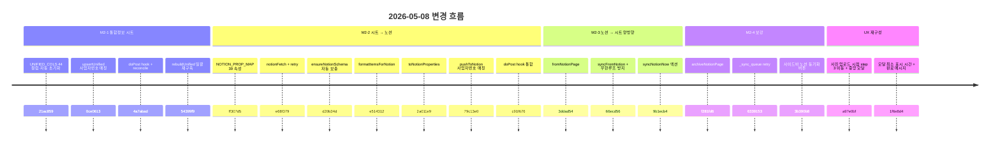

# BPK Smart 2026 — 개발 노트 (통합정보 시트 + 노션 양방향 동기화)

> **작성일** 2026-05-08
> **이전 노트** [2026-05-07_PDF_엔진_전환_및_기능_정리_개발노트.md](./2026-05-07_PDF_엔진_전환_및_기능_정리_개발노트.md)
> **커밋 범위** `48449bd` (이전 노트 작성 시점) → `52d2c1a` (양방향 sync 운영 적용)
> **주제** 통합정보 시트 자동 생성 + 노션 데이터베이스 양방향 실시간 동기화 + 신청 폼 UX 재구성

---

## 0. 한눈에 보기

이번 라운드의 핵심은 **신청·견적 데이터를 통합정보 시트로 일원화하고 노션 데이터베이스와 양방향 실시간 동기화**한 것입니다. 관리자가 견적 웹페이지와 노션 두 곳만 보면서 운영할 수 있도록 시트는 raw 저장소로 후방화했습니다.

부가적으로 운영 중 발견된 사진 업로드 이슈를 해결하기 위해 **신청 폼의 사진 업로드 시점을 step 5(완료 직전) → step 3(매칭 시작)로 이동**했고, 차단 모달로 사용자 인지를 강화했습니다.



총 **30+ commits**, 코드 변경 약 **+1,800 lines**, 신규 파일 1개(`apps_script/NotionSync.gs`).

---

## 1. 설계 단계 — Spec → Plan → Implementation

이번 작업은 처음으로 **brainstorming → spec → plan → execution**의 정식 워크플로우를 따랐습니다.

### 1.1 산출 문서

| 문서 | 위치 |
|---|---|
| 설계 문서 (단일 출처) | `docs/superpowers/specs/2026-05-08-통합정보-노션동기화-design.md` |
| 17-task 구현 계획서 | `docs/superpowers/plans/2026-05-08-통합정보-노션동기화.md` |
| 노션 DB 39속성 카탈로그 | `docs/notion-sync/노션DB속성목록.md` |
| 사용자 작업 체크리스트 | `docs/notion-sync/사용자작업체크리스트.md` |

### 1.2 핵심 디자인 결정 (Spec §1.3)

| 결정 | 채택 |
|---|---|
| 노션 연결 방식 | Apps Script가 Notion REST API 직접 호출 (`UrlFetchApp`) |
| 양방향 동기화 범위 | 운영 4 필드 (`status` / `manager` / `memo` / `quoteMemo`) |
| 단방향 정책 | "되돌리기" — 노션에서 단방향 컬럼 수정 시 매 sync마다 시트값으로 자동 복원 |
| 노션 DB 스키마 | 사용자가 빈 DB 만들고 GAS의 `ensureNotionSchema`가 누락 속성 자동 보충 |
| 한글 ↔ 영문 매핑 | `NOTION_PROP_MAP` 단일 출처 |
| 폴링 주기 | 5분 + 운영자용 즉시 동기화 버튼 |
| 매칭 키 | 사업자번호 (재신청 시 신청ID는 변경되므로) |
| 시트 삭제 시 노션 | 휴지통 archive (30일 보관) |
| 노션 페이지 직접 삭제 시 | 다음 sync에서 자동 재생성 |
| 같은 사업자 재신청 | 기존 노션 페이지 PATCH (page ID 유지 → 운영자 메모 보존) |

### 1.3 Subagent-Driven Development

17 task 모두 **fresh subagent + 2-stage review (spec compliance → code quality)** 패턴으로 진행. 각 task마다:
1. Implementer subagent가 코드 작성·commit
2. Spec reviewer subagent가 요구사항 부합 검증
3. Code quality reviewer subagent가 품질 검증
4. 필요 시 Fixer subagent로 폴리시·버그 수정

이 프로세스에서 **Reviewer가 잡아낸 이슈 8건을 머지 전에 수정**했고, 운영 적용 후에도 7건의 추가 이슈를 잡아 fix 했습니다.

---

## 2. 데이터 모델

### 2.1 통합정보 시트 (44 컬럼)

신청 시트 28컬럼 + 견적 시트에서 16컬럼 (충돌은 `quote*` prefix). `bizno`가 unique 매칭 키.

```
[신청 28]
id, company, ceo, bizno, phone, email, address,
pname, texture, processes, pkgtypes, qty, speed, memo,
problem_type, problem_points, equipment, electric, air_yn, air_flow,
space_w, space_h, space_photos, product_photos,
status, date, manager, contentHash

[견적 16 — 충돌 quote* prefix]
quoteId, quoteProcess, quoteMemo, validUntil,
items, options, total, eqCount,
quoteStatus, quoteDate, pdfUrl, equipPdfUrl,
pdfHash, equipPdfHash, version, isLatest
```

### 2.2 노션 DB (39 속성)

매핑 정책:
- 시트 영문 컬럼명 ↔ 노션 한글 속성명 (`NOTION_PROP_MAP` 단일 출처)
- 운영자가 자유롭게 추가하는 컬럼은 sync가 절대 안 건드림 (NOTION_NAME_TO_SHEET 조회 miss → silent skip)

핵심 매핑 (전체는 `docs/notion-sync/노션DB속성목록.md` 참조):

| 시트 | 노션 | 타입 | 양방향 |
|---|---|---|---|
| `company` | 회사명 | **Title** | ❌ |
| `bizno` | 사업자번호 | rich_text | ❌ (매칭 키) |
| `status` | 신청상태 | select | ✅ |
| `manager` | 담당자 | rich_text | ✅ |
| `memo` | 신청메모 | rich_text | ✅ |
| `quoteMemo` | 견적메모 | rich_text | ✅ |
| `__summary` (가상) | 견적요약 | rich_text | ❌ — `formatItemsForNotion`이 합성 |

### 2.3 _sync_queue 시트 (자동 생성)

Notion API 실패 시 적재 → 다음 5분 폴링에서 재처리. 3회 실패 시 포기 + 운영자 알림 로그.

| 컬럼 | 용도 |
|---|---|
| `id` | 큐 항목 ID (`q<timestamp>-<rand>`) |
| `action` | `pushToNotion` / `archiveNotionPage` |
| `payload_json` | 원본 호출 인자 (직렬화) |
| `retry_count` | 재시도 횟수 (3 초과 시 drop) |
| `last_error` | 마지막 에러 (500자 truncate) |
| `created_at` | 적재 시각 ISO 8601 |

---

## 3. 시스템 아키텍처

```
[고객 신청 폼]                      [공급기업 관리 (관리자)]
신청기업_장비신청.html              공급기업_관리.html
        │                                  │
        │ saveApp                          │ saveQt / updateApp / deleteApps
        │ (사진은 step 3에서 미리 업로드)   │ syncNotionNow (사이드바 버튼)
        ▼                                  ▼
        ┌──────────────────────────────────────────┐
        │  Apps Script — 동기화 허브                │
        │                                          │
        │  apps_script/Code.gs                     │
        │  ├ doPost (라우터 + _safeSync hook)      │
        │  └ 기존 CRUD/auth/upload                  │
        │                                          │
        │  apps_script/NotionSync.gs (신규)        │
        │  ├ upsertUnified (시트 통합)             │
        │  ├ pushToNotion (시트 → 노션)            │
        │  ├ syncFromNotion (노션 → 시트, 5분 폴링) │
        │  ├ archiveNotionPage (휴지통 이동)       │
        │  ├ _sync_queue retry (3회 한도)          │
        │  └ 진단 함수들                            │
        └──┬─────────────────────────────┬─────────┘
           │ 즉시 (<3초)                  │ 5분 폴링 + 즉시 버튼
           ▼                             ▼
   ┌─────────────────┐           ┌─────────────────┐
   │ Spreadsheet     │           │ Notion DB       │
   │ ├ 장비           │           │ (운영자 화면)    │
   │ ├ 신청           │           └─────────────────┘
   │ ├ 견적           │
   │ ├ 통합정보 NEW  │
   │ ├ 설정           │
   │ └ _sync_queue NEW│
   └─────────────────┘
```

### 3.1 시트 → 노션 (즉시 push)

```
saveApp 들어옴
  → appendRow(SN.APP, ...)
  → _safeSync('upsertUnified after saveApp', () => upsertUnified(data))
  → _safeSync('pushToNotion after saveApp', () => {
       var row = _loadUnifiedByBizno(data.bizno);
       if (row) pushToNotion(row);
     })
```

`_safeSync`로 격리되어 노션 호출 실패해도 시트 저장은 성공.

### 3.2 노션 → 시트 (5분 폴링)

```
GAS Time Trigger (5분)
  → syncFromNotion()
  → query Notion DB where last_edited_time > LAST_SYNC_AT
  → 변경된 페이지마다 _applyNotionPageToSheet:
     ├ 양방향 4필드 + bizno 추출
     ├ _loadUnifiedByBizno로 통합정보 row 조회 (없으면 silent skip)
     ├ hash_<bizno>와 비교 (last-write-wins)
     ├ 양방향 필드만 시트 cell 단위 setValue (견적 컬럼 보존)
     ├ 신청·견적 시트 동기 갱신
     └ pushToNotion으로 단방향 컬럼 되돌리기
  → LAST_SYNC_AT = nowIso
  → _processSyncQueue (실패 큐 재처리)
```

### 3.3 무한루프 방지

양방향 sync에서 노션→시트 갱신이 다시 시트→노션 push를 트리거하지 않도록:

1. `pushToNotion`이 성공 시 양방향 4필드 hash를 `Script Properties: hash_<bizno>`에 저장
2. `_applyNotionPageToSheet`가 시트 갱신 후 새 hash로 갱신
3. 시트 hash가 마지막 push hash와 다르면 (= 시트가 그 사이 직접 변경됨) → last-write-wins로 sheet wins

### 3.4 충돌 해결

양방향 4필드에서 시트와 노션이 거의 동시에 변경된 경우:

```
시트 hash === 마지막 push hash → 노션 변경 적용 (notion wins)
시트 hash !== 마지막 push hash → 시트 우선 (sheet wins) + push로 노션 덮어쓰기
```

---

## 4. 사진 업로드 UX 재구성

### 4.1 문제 발견

운영 중 사용자가 보고: **"업체가 사진을 첨부하고 신청했는데 시트엔 정보가 없고 Drive에만 사진이 올라와 있다."**

원인: 옛 흐름은 **step 5 진입 시점에 백그라운드로 사진 업로드 + saveApp을 동시 실행**. 사진 5장이면 약 5~30초 소요되는데, 사용자가 "신청 완료" 메시지 보고 그 사이 창을 닫으면:

```
[옛 흐름]
사진 업로드 (5~30초) → saveApp (1~3초)
└── 이 사이에 사용자가 창 닫으면 ❌
    Drive에 사진은 올라가지만 시트엔 신청 정보 없음
```

### 4.2 새 흐름

사용자가 능동적으로 인지하는 시점(매칭 시작)으로 사진 업로드를 이동.

```
Step 1~2: 정보 입력
Step 3: 도입 희망 장비 + 사진 첨부 (선택만)
   │
   ▼ "매칭 시작" 버튼
   ┌─ 중앙 차단 모달 ─────────────────┐
   │  ━━━━━━━━━━━━━━━━━━━━━━━       │
   │  사진 3 / 5 업로드 중 (60%)     │
   │  ❗ 페이지를 닫지 마세요        │
   │  최소 1.5초 표시 + 0.6초 완료    │
   │  실패 시 [다시 시도]/[사진 없이] │
   └────────────────────────────────┘
   │
Step 4: 매칭 결과 (사진 URL 이미 확보)
   │
   ▼ "신청 확정" 버튼
   ┌─ 작은 저장 모달 ─┐
   │ saveApp (1~3초)  │
   └─────────────────┘
Step 5: 영수증
```

### 4.3 차단 모달 사양

- **위치**: 화면 중앙 작은 박스 (max-width 460px), dim overlay
- **차단**: X 버튼 없음, ESC 무시, 외부 클릭 차단, beforeunload confirm
- **최소 표시 시간**: 1.5초 + 완료 메시지 0.6초 = 사용자가 인지할 수 있는 최소 2.1초
- **실패 시**: [🔄 다시 시도] / [📋 사진 없이 진행] 두 버튼 — 사용자 자율 복구

### 4.4 효과

| | 옛 흐름 (step 5) | 새 흐름 (step 3) |
|---|---|---|
| 사용자가 보는 화면 | "✅ 신청 완료" (착각 가능) | 차단 모달 + 진행률 |
| 사용자 닫기 위험 노출 시간 | 5~30초 | 1~3초 (saveApp만) |
| 업로드 실패 시 사용자 인지 | 불가 (silent failure) | 즉시 인지 + 복구 가능 |

---

## 5. 운영 발견 이슈 + Fix (8건)

설계·구현 후 운영 검증 단계에서 발견된 이슈들.

| # | Commit | 이슈 | 원인 | 해결 |
|---|---|---|---|---|
| 1 | `593ffdd` | 통합정보 시트의 `quoteDate` 컬럼이 자동으로 datetime으로 변환되어 시간 잘림 | `_enforceTextDate`가 `date` 컬럼만 처리 | optional `colName` 파라미터 추가, `quoteDate`도 호출 |
| 2 | `8cda239` | `Number('abc') || 0` → 0으로 잘못 저장 | NaN을 0으로 fallback | `isNaN(n) ? null : n`로 변경, multi_select 비-JSON 단일값 보존 |
| 3 | `93cd757` | Retry-After 헤더 case 다양 | 정확한 대소문자만 체크 | case-insensitive iteration |
| 4 | `fbb8695` | 같은 사업자 재신청 시 통합정보의 견적 컬럼이 `0`/`[]`로 잘못 표시 | `_loadUnifiedByBizno`가 빈 시트값을 `Number('') === 0`으로 변환 | 빈 셀은 빈 문자열 유지, `formatItemsForNotion`도 빈 견적 시 빈 문자열 |
| 5 | `1ea83da` | 노션 견적요약에 `[옵션] 대형노즐 0원, 합계: 63M` (옵션 누락) | frontend 옵션 스키마(`{name,qty,price,unit}`)와 `formatItemsForNotion` 가정(`{name,amount}`) 불일치 | `_optAmount(o)` 헬퍼로 양 스키마 호환, qty>1 시 `(N SET)` 부가 표시 |
| 6 | `ebe0e78` | 시트 `2026-05-08 19:17` (KST) → 노션 `2026-05-09 04:17` (+9시간 drift) | `_normalizeDate`가 timezone offset 없는 ISO string 생성 → Notion이 UTC로 가정 | `+09:00` offset 명시 |
| 7 | `1f6e8d4` | 새 흐름 사진 업로드 모달이 "잠깐 보였다 사라짐" — 사용자가 인지 못함 | 빠른 네트워크에선 모달이 1초 미만 표시 | 최소 표시 시간 1.5초 + 완료 메시지 0.6초 |
| 8 | (별도 고지) | 일부 환경(Chrome 확장)에서 사진 업로드 차단 | AdBlocker / 프라이버시 확장이 cross-origin POST 차단 | 명확 실패 모달 + 사용자 자율 복구 (시크릿 창 안내) |

### 5.1 발견 패턴

운영 발견 이슈 8건 중 5건이 **데이터 변환 / 시간대 / 스키마 불일치** 종류. 단위 테스트로는 잡기 어려운 종류였고, 실제 사용자 데이터로 검증 시 발견됨. 향후 더 다양한 데이터로 단위 테스트 보강 검토.

### 5.2 진단 함수 정리

운영 디버깅을 빠르게 하기 위한 헬퍼 함수들:

| 함수 | 용도 |
|---|---|
| `_checkPrereqs` | Script Properties (TOKEN/DB_ID) 등록 확인 |
| `_test_notionFetch` | 노션 DB 연결 + 39속성 + Title 속성 확인 |
| `_test_notionMap` | NOTION_PROP_MAP 정합성 정적 검증 |
| `_test_ensureSchema` | 누락 속성 자동 보충 동작 확인 |
| `_test_formatItems` | 견적요약 변환 (신·옛 스키마, 빈 케이스) |
| `_test_toNotionProperties` | 시트값 → 노션 properties 변환 + 시간대 |
| `_test_pushToNotion_create/update` | 노션 페이지 생성·갱신 직접 테스트 |
| `_diagnoseLastQuoteSync(_force)` | 견적-통합정보 sync 누락 진단 + 강제 복구 |
| `_test_syncQueue` | 큐 적재 + 처리 사이클 |
| `_peek_syncQueue` | 큐 내용 출력 |
| `_scanFailedPhotoApps` | 옛 신청 중 사진 업로드 silent failure 카운트 |

---

## 6. 검증

### 6.1 Phase 별 검증 결과

| Phase | 검증 시나리오 | 결과 |
|---|---|---|
| M2-1 | 신청 → 통합정보 시트 자동 생성, 같은 사업자 재신청 → row 교체, 견적 발급 → 견적 컬럼 채워짐 | ✅ |
| M2-2 | 신청·견적 → 1~3초 안에 노션 페이지, 같은 사업자 재신청 → 페이지 PATCH (운영자 메모 보존), 견적요약 정상 표시 | ✅ |
| M2-3 | 노션에서 신청상태 변경 → 5분 안 시트 반영, 단방향 컬럼 변경 → 시트값으로 자동 복원, 무한루프 없음 | ✅ |
| M2-4 | 즉시 동기화 버튼 → 토스트 결과, 신청 전체 삭제 → 노션 archive (검증 보류), 큐 retry | ✅ (archive는 미검증 — 단일 삭제 UI 부재) |

### 6.2 운영자 직접 작업 (STAGE 1/2/3)

| Stage | 항목 | 상태 |
|---|---|---|
| 1 | Notion Integration 만들기 + Token 받기 | ✅ |
| 1 | 노션 DB 생성 + 39속성 추가 + Integration 연결 | ✅ |
| 1 | Script Properties 등록 (`NOTION_TOKEN`, `NOTION_DB_ID`) | ✅ |
| 2 | GAS 코드 적용 (Code.gs + NotionSync.gs) | ✅ |
| 3 | 5분 폴링 트리거 등록 (`syncFromNotion`) | ✅ |
| 3 | GAS 새 deploy + config.js URL 갱신 | ✅ (commit `0e01afd`) |

---

## 7. 변경되지 않은 것 (영향 없음)

기능 영향 없음 확인:

- 기존 신청 폼의 1~2 단계 입력 흐름
- 견적서 PDF 생성 (`buildQuotePdf` 등)
- 견적 발급 시 PDF Drive 업로드 + Drive 폴더 구조
- 매칭 알고리즘 (`runScoring`, `_scoreEquip`)
- 사이드바 메뉴 구조 (시스템 섹션 아래에 노션 동기화 메뉴 추가만)
- 신청업체 관리 화면의 중복 정리 모달
- 견적서 관리 화면의 버전 히스토리

---

## 8. 향후 작업

### 8.1 단기 (이슈 발생 시 즉시)

- **사이드바의 매칭 결과 화면 장비 사진 CORB 차단** — 일부 옛 데이터 URL이 `uc?export=view` 형식. thumbnail URL로 통일 작업.
- **신청 단일 삭제 UI** — 의도적으로 제한했으나 운영 중 필요성 발견 시 추가 (`apiCall('deleteApps', { ids:[...] })`).
- **사진 업로드 부분 실패 감지 강화** — 현재는 "모든 사진 base64 폴백일 때만" 실패 판정. 하나라도 실패면 모달 띄우는 식으로 강화.

### 8.2 중기 (운영 안정화 후)

- **양방향 범위 옵션 1 → 옵션 2 확장** — 텍스트성 컬럼(전화번호, 이메일 등)도 양방향 포함 검토.
- **`_sync_queue` 누적 모니터링** — 큐 항목 20건 초과 시 운영자 알림 자동화.
- **옛 업체 60개 노션 등록** — 사용자가 보유한 옛 업체 데이터를 노션에 등록하는 작업 (옵션 A/B/C 중 결정 필요).
- **운영 발견 이슈에 대한 단위 테스트 보강** — 시간대, 스키마 불일치 등을 빠르게 잡을 수 있도록.

### 8.3 장기 (사용자 요청 시)

- **Notion Webhook 정식 지원 시 폴링 → webhook 전환** — 현재 베타. 정식화 시 5분 폴링 → 즉시 반영 가능.
- **장비 사진 단방향 동기화** — 현재는 신청·견적만. 장비도 노션에 보고 싶으면 별도 페이지로 등록.
- **운영자 알림 채널** — _sync_queue 3회 실패, 노션 archive 등 운영자가 즉시 알아야 할 이벤트를 이메일/슬랙 알림.

---

## 9. 빠른 점검 — 다음 세션 진입 시

```
□ git checkout main && git pull
□ feature/notion-sync 브랜치 정리 결정 (이미 머지됨)
□ docs/superpowers/specs/ 와 docs/superpowers/plans/ 문서 검토
□ docs/notion-sync/사용자작업체크리스트.md 운영 가이드 재확인
□ Apps Script Triggers에 syncFromNotion 5분 폴링 살아있는지
□ _sync_queue 시트 비어있는지 (운영 중 누적 안 됐는지)
□ 노션 DB의 운영자 자유 컬럼이 sync에 안 영향 받는지 재확인
```

---

## 부록 A — 새로 추가된 함수 인덱스

### Code.gs (수정)

| 위치 | 변경 |
|---|---|
| 상수 | `UNIFIED_COLS`, `UNIFIED_ARR`, `UNIFIED_NUM`, `QUEUE_COLS`, `SN.UNIFIED`, `SN.QUEUE` 추가 |
| `autoInitSheets` | 통합정보 + _sync_queue 시트 자동 생성 |
| `serializeRow` | 빈 배열은 시트에 빈 셀로 저장 (가독성) |
| `_enforceTextDate` | optional `colName` 파라미터 — quoteDate에도 사용 |
| `doPost` switch | 5개 case에 sync hook + trace 로그 + `case 'syncNotionNow'` |

### NotionSync.gs (신규, ~1300 lines)

| 함수 | 역할 |
|---|---|
| `upsertUnified(app, quote?)` | 통합정보 시트 사업자번호 매칭 upsert |
| `_findApp(appId)` | 신청 시트에서 id로 객체 1건 |
| `_loadUnifiedByBizno(bizno)` | 통합정보 row 객체 로드 |
| `_reconcileAfterDelete(deletedIds)` | 신청 삭제 후 사업자별 잔여 신청 재조정 + 노션 archive |
| `_safeSync(label, fn)` | doPost hook 표준 try-catch 패턴 |
| `rebuildUnified()` | 신청+견적으로부터 통합정보 일괄 재구축 (장애 복구) |
| `getNotionConfig()` | Script Properties에서 token/dbId |
| `notionFetch(method, path, payload)` | UrlFetchApp 래퍼 + retry |
| `ensureNotionSchema()` | 누락 속성 자동 보충 (옵션 C) |
| `formatItemsForNotion(items, options)` | 견적요약 텍스트 합성 (`_optAmount` 헬퍼) |
| `_toNotionValue(type, val)` / `_emptyValueFor(type)` | 11 타입 변환 |
| `toNotionProperties(unifiedRow)` | 시트 row → 노션 properties |
| `_findNotionPageByBizno(bizno)` | 사업자번호 query |
| `_bidirectionalHash(unifiedRow)` | 무한루프 방지 hash (16자 hex) |
| `pushToNotion(unifiedRow)` | 사업자번호 매칭 PATCH/POST |
| `_fromNotionValue(prop)` / `fromNotionPage(page, onlyBidirectional)` | 노션 → 시트값 역변환 |
| `syncFromNotion()` | 5분 폴링 본체 |
| `_applyNotionPageToSheet(page)` | 페이지 1개의 양방향 변경 시트 반영 |
| `archiveNotionPage(bizno)` | 사업자번호로 노션 페이지 휴지통 이동 |
| `_enqueueSync(action, payload, error)` | 실패 큐 적재 |
| `_processSyncQueue()` | 큐 재처리 (3회 한도) |
| `NOTION_PROP_MAP` 등 상수 | 39속성 매핑, BIDIRECTIONAL_FIELDS, QUEUE_COLS, ... |
| 진단 함수 | `_check*`, `_test_*`, `_diagnose*`, `_peek_syncQueue`, `_scanFailedPhotoApps` |

### 신청기업_장비신청.html (수정)

| 함수 | 변경 |
|---|---|
| `goStep3` | sync → async, `_uploadPhotosWithModal` 호출 추가 |
| `goStep5` | 사진 업로드 로직 제거, saveApp만 호출 + 작은 저장 모달 |
| `_uploadPhotosWithModal(company)` | 신규 — 중앙 차단 모달 + 사진 업로드 + 실패 시 retry/skip |
| `resetForm` | upload-banner 초기화 → cm/sm overlay 초기화 |

### 공급기업_관리.html (수정)

| 위치 | 변경 |
|---|---|
| 사이드바 시스템 섹션 | "🔄 노션 동기화" nav-item 추가 (매칭 설정 아래) |
| JS | `syncNotionNow()` async 함수 추가 |

---

## 부록 B — 트러블슈팅 노트

### B.1 같은 사업자 재신청 시 통합정보의 견적 컬럼이 0/[]로 표시됨

**증상**: 같은 사업자번호로 재신청 시 통합정보의 `total`이 `0`, `items`가 `[]`로 표시됨.

**원인**: `upsertUnified`가 견적 인자 없을 때 견적 컬럼을 빈 문자열로 초기화. `serializeRow`가 ARR 컬럼을 `[]` JSON 직렬화. 이후 `_loadUnifiedByBizno`가 빈 셀을 `Number('') === 0`으로 변환.

**해결** (`fbb8695`):
- `_loadUnifiedByBizno`에서 number 컬럼 빈 셀은 빈 문자열 유지
- `serializeRow`에서 빈 배열은 빈 셀로 저장
- `formatItemsForNotion`에서 빈 견적 시 빈 문자열 반환

### B.2 노션 시간이 +9시간 drift

**증상**: 시트 `2026-05-08 19:17` (KST) → 노션 `2026-05-09 04:17`.

**원인**: `_normalizeDate`가 timezone offset 없는 ISO string 생성. Notion API가 UTC로 가정하고 사용자 워크스페이스 timezone(KST)으로 표시 시 +9시간 차이.

**해결** (`ebe0e78`): time component 있을 때 `+09:00` offset 명시.

```js
// 변경 전
return m[1] + '-' + m[2] + '-' + m[3] + 'T' + m[4] + ':' + m[5] + ':00';
// 변경 후
return m[1] + '-' + m[2] + '-' + m[3] + 'T' + m[4] + ':' + m[5] + ':00+09:00';
```

### B.3 옵션 표시가 "0원"

**증상**: 노션 견적요약에 `[옵션] 대형노즐 0원, 소형노즐 0원`. 합계도 옵션 가격 누락.

**원인**: frontend 옵션 객체 `{name, qty, price, unit}`인데 `formatItemsForNotion`이 옛 스키마 `{name, amount}`를 가정.

**해결** (`1ea83da`): `_optAmount(o)` 헬퍼로 `o.amount` 우선, 없으면 `o.price` 사용. qty > 1 시 `(N SET)` 부가 표시.

### B.4 견적 발급해도 통합정보에 견적 컬럼 안 채워짐

**증상**: 견적 시트엔 row 정상, 통합정보 시트엔 견적 컬럼이 빈 채로 유지.

**원인 가능성**: 진단 함수 `_diagnoseLastQuoteSync` 실행 시 `_findApp` 성공, 통합정보 row 발견. 즉 saveQt 시점에 hook이 호출 안 됐거나 실패했지만 `_safeSync`로 격리됨. 가장 흔한 원인은 GAS deploy 갱신 빠뜨림 (옛 코드 실행).

**진단 절차**:
1. `_diagnoseLastQuoteSync` ▶ Run — 어디서 막혔는지 진단
2. Apps Script Executions → 최근 doPost 실행 로그 → `[saveQt]` trace 확인
3. 위 둘 다 정상이면 `_diagnoseLastQuoteSync_force`로 강제 복구

### B.5 일부 환경에서 사진 업로드 차단 (Chrome 확장)

**증상**: 신청자가 사진 첨부 후 매칭 시작 → 모달 떴다 사라짐 → Drive에 사진 안 올라감.

**원인**: 일부 광고 차단·프라이버시 보호 Chrome 확장이 cross-origin POST를 차단. 우리 코드 수준에서 완전 우회 불가.

**해결책 (대응)**:
- 명확한 실패 모달 + 사용자 자율 복구 (`[다시 시도]` / `[사진 없이 진행]`)
- 운영자에게 시크릿 창 안내
- 부분 실패 감지 강화 검토 (향후)

**확인**: `_scanFailedPhotoApps` 함수로 옛 신청의 silent failure 카운트 확인 가능.

### B.6 모달이 "잠깐 보였다 사라짐"

**증상**: 사진 업로드 모달이 1초 미만 표시되고 사라져 사용자가 "업로드 안 됐다"고 인지.

**원인**: 빠른 네트워크에서 사진 1장 업로드가 1초 미만 끝남. 또는 사진이 이미 URL이라 `apiUploadPhoto` shortcircuit.

**해결** (`1f6e8d4`): 모달 최소 표시 시간 1.5초 + 완료 메시지 "✅ 업로드 완료" 0.6초 = 총 2.1초. 진단 로그도 추가 (`[upload modal] start/urls received/success`).

---

**Drafted by Claude · Reviewed for: SeonjeCho · 2026-05-08**
