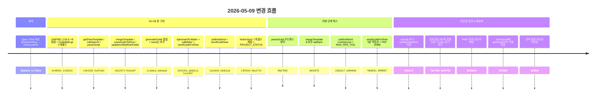

# BPK Smart 2026 — 개발 노트 (동영상 가이드 메일 자동 생성·발송)

> **작성일** 2026-05-09
> **이전 노트** [2026-05-08_통합정보_노션_양방향_동기화_개발노트.md](./2026-05-08_통합정보_노션_양방향_동기화_개발노트.md)
> **커밋 범위** `bcc2997` (이전 노트 작성 시점) → `155ff4e` (멱등성 수정)
> **주제** 견적서 발급 시 GPT-4o-mini로 동영상 촬영 스크립트 자동 작성 + 메일 HTML 합성 + Drive 보관 + 노션 체크박스로 발송 트리거 시스템 구축

---

## 0. 한눈에 보기

이번 라운드는 **2026 소공인 스마트제조지원사업** 신청기업이 제출해야 하는 **동영상 촬영 대본을 GPT가 회사별로 자동 작성**하고, BPK 담당자가 노션에서 체크박스 한 번으로 메일을 발송할 수 있는 자동화 시스템을 구축한 작업입니다.



총 **약 36 commits**, 코드 변경 약 **+1,500 lines**, 신규 파일 2개(`apps_script/GuideMail.gs`, `apps_script/mailer/Code.gs`).

---

## 1. 설계 단계 — Spec / Plan / Subagent 실행

이번 작업도 **brainstorming → spec → plan → subagent-driven execution** 워크플로우로 진행했습니다. 단, 실행 단계는 이전 라운드와 달리 **subagent-driven-development** 스킬로 D1~D8 8개 배치 디스패치 + 단계별 spec/품질 2단 리뷰 패턴을 사용했습니다.

### 1.1 산출 문서

| 문서 | 위치 |
|---|---|
| 설계 문서 (Spec) | `docs/superpowers/specs/2026-05-09-video-script-email-guide-design.md` |
| 8 phase / 17 task 구현 계획서 (Plan) | `docs/superpowers/plans/2026-05-09-video-script-email-guide.md` |

### 1.2 핵심 기획 결정

| 의사결정 | 선택지 | 채택안 |
|---|---|---|
| 발송 트리거 | 자동 vs 미리보기 vs 노션 체크 | **노션 체크박스 + 5분 폴링** (담당자 검수 + 즉시성 절충) |
| 발송 계정 분리 | smart@paxc / bpksmart26 alias / 이중 Apps Script | **이중 Apps Script** (기존 시스템 무손상) |
| Make.com 위치 | 메인 발송 vs 백업 | **백업** (장애 복구·수동 재발송 용도) |
| 폴링 vs Webhook | 5분 폴링 vs Notion 자동화 | **폴링** (노션 무료 플랜 + 비용 0) |
| HTML 저장 | 시트 셀 vs Drive 파일 | **Drive 파일** (편집·미리보기·버전 관리 모두 우월) |
| 모델 | gpt-4o-mini vs gpt-4o | **gpt-4o-mini** (1,900회사 ≈ $1) |
| 스크립트 저장 형식 | JSON / 마크다운 / 5셀 분리 | **마크다운 한 셀** (사람 읽기 + 코드 처리 균형) |

---

## 2. 시스템 아키텍처

### 2-1. 두 개의 Apps Script 분리

```
┌──────────────────────────────────────────────────────┐
│ smart@paxc.co.kr  ●  메인 Apps Script                │
│ (기존: 시트/Drive/노션 sync/PDF 생성)                │
│ ─ 추가: GPT 호출, HTML 합성, Drive 저장, 폴링/위임   │
└────────────────┬─────────────────────────────────────┘
                 │ POST { token, to, subject, html, attachments }
                 ↓
┌──────────────────────────────────────────────────────┐
│ bpksmart26@gmail.com  ●  메일 전용 Apps Script       │
│ (신규: 50줄, GmailApp.sendEmail 만 수행)             │
│ → 발송 시 bpksmart26 보낸 메일함에 자동 저장         │
└──────────────────────────────────────────────────────┘
```

**왜 분리했나?**
- Sheets/Drive 소유 계정(`smart@paxc.co.kr`)과 메일 발송 계정(`bpksmart26@gmail.com`)이 다름
- `GmailApp.sendEmail()`은 **스크립트 실행 계정**의 Gmail로만 발송되며 보낸함도 그 계정에 저장됨
- alias / Workspace impersonation 모두 본함 격리 요구사항 위배 → 이중 Apps Script가 유일한 깔끔한 해법

### 2-2. 발송 경로 (이중 트랙)

**기본 (폴링):**
```
사용자 노션에서 [가이드발송요청] 체크
  → 노션→시트 양방향 sync (기존 인프라)
  → 시트의 guide_send_request = TRUE
  → smart@paxc Apps Script 5분 시간 트리거 (pollAndSend)
  → bpksmart26 Web App 호출 → GmailApp 발송
  → 시트 status = '발송완료' → 시트→노션 sync 자동 반영
```

**백업 (Make.com 슬림 시나리오):**
```
노션 페이지 [즉시발송] URL 클릭
  → Make Webhook (2 ops)
  → HTTP 모듈 → smart@paxc의 sendGuideNow 액션
  → 폴링과 동일한 발송 로직 재사용 (DRY)
```

Free 1,000 ops로 ~500회 백업 가능 (백업이라 충분).

---

## 3. 데이터 모델 변경

### 3-1. 통합정보 시트 — 8개 컬럼 추가

```javascript
// UNIFIED_COLS 끝에 추가
'guide_script','guide_generated_at','guide_html_url','guide_version',
'guide_send_request','guide_sent_at','guide_sent_status','guide_error'

const UNIFIED_BOOL = { guide_send_request:'boolean' };  // 신설
```

| 컬럼 | 타입 | 노션 sync | 노션 속성 |
|---|---|---|---|
| `guide_script` | 마크다운 텍스트 | ✅ | 텍스트 |
| `guide_generated_at` | KST 일시 | ✅ | 날짜 |
| `guide_html_url` | URL | ✅ | URL |
| `guide_version` | 숫자 | ✅ | 숫자 |
| `guide_send_request` | 불리언 | ✅ (양방향) | 체크박스 |
| `guide_sent_at` | KST 일시 | ✅ | 날짜 |
| `guide_sent_status` | 한글 | ✅ | **선택(Select)** |
| `guide_error` | 텍스트 | ❌ (시트만) | — |

`guide_sent_status` Select 옵션: `대기중` / `발송완료` / `발송실패` (회색/초록/빨강).

### 3-2. 한글 상태 상수

```javascript
const GUIDE_STATUS = {
  PENDING: '대기중',
  SENT:    '발송완료',
  FAILED:  '발송실패'
};
```

시트와 노션 Select 옵션 둘 다 한글 값을 그대로 사용. 코드는 항상 상수로 참조.

### 3-3. Drive 파일 명명

```
{회사명}_가이드메일_{YYYYMMDD-HHmm}_v{N}.html
예: ㈜대원팩_가이드메일_20260509-1430_v1.html
```

- Drive 폴더 ID: `1FPJebwdF6HeoKd-UXFMKYhowHxJL6arY`
- 모든 버전 보관, 시트(노션)에는 최신 버전 URL만
- `_template.html`도 같은 폴더에 저장 (마스터 템플릿, 5분 캐시)

---

## 4. 컴포넌트

### 4-1. 메인 Apps Script (`apps_script/GuideMail.gs`, 660줄 신규)

| 함수 | 책임 |
|---|---|
| `getDriveTemplate()` | `_template.html` 로드 + 5분 캐시 + PART 마커 정규식 검증 |
| `callOpenAI(input)` | gpt-4o-mini 호출, 한국어 5 PART 마크다운 응답 |
| `parseScript(md)` | `## PART N` 정규식 split → `{part1..part5}` 객체 |
| `mergeTemplate(html, parts)` | 5개 `<!-- PART N -->` 마커 본문 td 치환 (split/join 기반) |
| `_formatPartHtml(text)` | 텍스트 → HTML (escape + `**` → `<strong>` + `\n` → `<br>`) |
| `saveGuideToDrive(html, company, version)` | 버전 파일명으로 Drive 저장 + 공유 링크 발급 |
| `updateUnifiedRowFields(id, fields)` | 통합정보 시트 부분 업데이트 (id 매칭, 컬럼 누락 skip) |
| `generateGuide(unifiedRow)` | **메인 진입점** — 위 함수들을 조합해 전체 흐름 실행 |
| `callMailer(payload)` | bpksmart26 Web App 호출 (UrlFetchApp + 토큰) |
| `sendGuideForRow(unifiedRow)` | 한 행 메일 발송 + 시트 상태 업데이트 (멱등성/PDF가드 포함) |
| `pollAndSend()` | 5분 시간 트리거. LockService + MAX_PER_TICK 30 안전망 |
| `sendGuideNow(data)` | Make.com 백업 진입점 (MAKE_TOKEN 검증 + 단일 행 처리) |

### 4-2. 메일 전용 Apps Script (`apps_script/mailer/Code.gs`, 50줄 신규)

```javascript
function doPost(e) {
  // 1. JSON 파싱
  // 2. MAILER_TOKEN 검증
  // 3. to/subject/html 필수 체크
  // 4. attachments base64 → Blob 디코드
  // 5. GmailApp.sendEmail(to, subject, '', { htmlBody, name, replyTo, attachments })
  // 6. JSON 응답
}
```

bpksmart26 계정에 별도 프로젝트로 배포 (실행 사용자: 본인). 본함이 자동으로 bpksmart26에 들어감 ✓

### 4-3. NotionSync 매핑 확장

```javascript
// NOTION_PROP_MAP 끝에 7개 추가 (guide_error는 시트 전용)
guide_script:        { name: '가이드스크립트',     type: 'rich_text' },
guide_generated_at:  { name: '가이드생성일',       type: 'date' },
guide_html_url:      { name: '가이드메일HTML',     type: 'url' },
guide_version:       { name: '가이드버전',         type: 'number' },
guide_send_request:  { name: '가이드발송요청',     type: 'checkbox',  bidirectional: true },
guide_sent_at:       { name: '가이드발송일',       type: 'date' },
guide_sent_status:   { name: '가이드발송상태',     type: 'select' }

// BIDIRECTIONAL_FIELDS에 추가
['status','manager','memo','quoteMemo','guide_send_request']
```

**기존 `_toNotionValue` / `_fromNotionValue`가 이미 checkbox / select / rich_text / date / url / number 모두 지원**하고 있어서 매핑만 추가하면 자동으로 양방향 sync 동작.

---

## 5. 운영 중 발견된 5가지 이슈와 수정

D1~D8 본 구현 완료 후 사용자가 실제로 테스트하면서 발견한 문제들. 각각이 흥미로운 케이스라 모두 기록.

### 5-1. saveQt 후크 race condition (`23fcb7d`)

**증상:** 견적서 발급 첫 클릭 → 시트 저장 + 노션 sync 됐는데 PDF 생성 안 됨. 같은 회사 두 번째 클릭하면 PDF 생성됨.

**원인:** saveQt에 `generateGuide`를 동기 호출하면서 응답이 5초 → 25초로 지연. 그 사이 60초 자동 폴링(`_backgroundRefresh`)이 발동해서 `quotes = qtRes.data`로 로컬 배열 통째 교체. 첫 번째에 push한 qt가 사라져서 `genPDF`의 `quotes.find(qtId)`가 undefined → 조용히 종료.

**해결:** 후크를 saveQt → updateQt(pdfUrl)로 이동. 이게 의미적으로도 정확 — 사용자가 원래 명시한 "PDF가 Drive에 저장된 시점에 스크립트 작성 시작" 시나리오와 맞음. updateQt는 `genPDF` Drive 업로드 직후 fire-and-forget IIFE에서 호출되므로 동기 후크여도 사용자 체감 없음.

**교훈:** 동기 후크의 응답 지연이 클라이언트의 다른 동시 동작과 race할 수 있음. spec 작성 시 "어디서 트리거"를 코드 흐름까지 추적해서 결정해야 함.

### 5-2. PDF 진행 모달 + Drive 동기 대기 (`aef476b`)

기존 `genPDF`는 Drive 업로드를 fire-and-forget IIFE로 처리 → 사용자는 PDF 다운로드만 보고 Drive 업로드는 백그라운드라 진행 상황 모름.

추가한 진행 모달:
- 차단형 (z-index 99999, blur backdrop)
- 5단계 progress: 폰트 / 사진 / PDF / 다운로드 / Drive
- Drive 업로드를 IIFE 대신 `await`로 변경 → 모달이 Drive 완료까지 유지
- 완료 시 1.5초 후 자동 닫기, 실패 시 사용자가 닫기

`showPdfProgress(stage, total, label)` / `hidePdfProgress(success, message)` 헬퍼를 `common.js`에 추가. 기존 `showApiLoading`은 다른 흐름에서 그대로 사용.

### 5-3. PART 3 마커 정규식 매칭 (`0933904`)

**증상:** 통합정보 시트에 `guide_sent_status='발송실패'`, `guide_error='템플릿에 <!-- PART 3 --> 없음'`. Drive에 HTML 파일 안 만들어짐.

**원인:** `_template.html`의 PART 3 주석에 `(핵심)` 추가 텍스트가 있음 (`<!-- PART 3 (핵심) -->`). 우리 코드는 `indexOf('<!-- PART 3 -->')` 정확 매칭이라 실패.

**해결:** 정규식 매칭으로 변경.

```javascript
// 기존: const idx = html.indexOf('<!-- PART ' + i + ' -->');
// 변경:
const markerRe = new RegExp('<!--\\s*PART\\s*' + i + '[^>]*?-->', 'i');
const m = markerRe.exec(html);
const idx = m ? m.index : -1;
```

`getDriveTemplate` 검증 단계에서도 동일한 정규식으로 5개 마커 모두 검사하도록 강화.

### 5-4. 장비사양서 PDF 자동 생성 (`bf7bfb6`)

**증상:** 사용자가 UI에서 「장비」 버튼을 삭제했더니 장비사양서 PDF가 안 만들어짐. `genEquipPDF` 함수는 존재.

**원인:** 원래부터 `genEquipPDF`는 사용자가 「장비」 버튼을 명시적으로 클릭해야 발동하는 구조. `sendQuote`(견적 발급) 흐름에는 포함되어 있지 않았음.

**해결:** `sendQuote`에서 `genPDF` 다음에 `genEquipPDF`를 자동 호출하도록 추가.

```javascript
try {
  await genPDF(qt.id);
} catch(e) {
  ...
  return;  // 견적서 PDF 실패 시 장비사양서 시도 안 함
}
try {
  await genEquipPDF(qt.id);
} catch(e) {
  ...  // 장비사양서 실패는 토스트만
}
```

### 5-5. generateGuide 멱등성 — 같은 견적 버전 중복 실행 방지 (`155ff4e`)

**증상:** 5-4 수정 후 가이드 HTML 파일이 같은 회사에 대해 2개씩 생성됨.

**원인:** `sendQuote`가 `genPDF` + `genEquipPDF`를 차례로 호출 → 각자 끝에 `syncQt(q, false)` (= updateQt) 호출 → 둘 다 `data.pdfUrl` 채워져 있어서 후크가 두 번 발동 → `generateGuide`가 두 번 실행됨.

**해결:** 견적 버전과 가이드 버전을 비교해서 이미 생성된 견적 버전이면 skip.

```javascript
var quoteVersion = parseInt(data.version, 10) || 0;
var guideVersion = parseInt(row.guide_version, 10) || 0;
if (quoteVersion > 0 && quoteVersion <= guideVersion) {
  Logger.log('skip — quote v' + quoteVersion + ' 이미 가이드 v' + guideVersion + ' 생성됨');
  return;
}
```

| 시점 | quote.version | guide_version | 동작 |
|---|---|---|---|
| 첫 발급 → genPDF 후 | 1 | 0 | 실행 (1>0) |
| 첫 발급 → genEquipPDF 후 | 1 | 1 | skip (1≤1) |
| 재발급 v2 → genPDF 후 | 2 | 1 | 실행 (2>1) |
| 재발급 v2 → genEquipPDF 후 | 2 | 2 | skip (2≤2) |

---

## 6. 코드 품질 리뷰에서 잡힌 안전성 픽스 4건

D6 (메일 발송 파이프라인) 단계에서 코드 품질 reviewer가 production-safety 이슈 4개를 발견. 모두 atomic commit으로 적용:

| 픽스 | 커밋 | 내용 |
|---|---|---|
| `pollAndSend` LockService | `333eb17` | `tryLock(0)`로 동시 5분 트리거 실행 시 중복 발송 방지 |
| `pollAndSend` MAX_PER_TICK 30 | `e0b464b` | Apps Script 6분 timeout 안전망. 30개 초과는 다음 틱에서 처리 |
| `sendGuideForRow` 5분 멱등성 | `f9e8251` | Make 재시도 / 동시 폴링 / 운영자 더블클릭 시 5분 내 중복 발송 차단 |
| `sendGuideForRow` PDF 20MB 가드 | `984fb67` | Gmail 25MB 한도 보호. 초과 PDF는 첨부 생략 (메일은 발송) |

추가로 D2/D3에서 잡힌 두 가지:

| 픽스 | 커밋 | 내용 |
|---|---|---|
| `parseScript` 코드펜스 방어 | `89e7592` | GPT가 ` ```markdown ... ``` ` 으로 응답 시 트레일링 펜스가 PART 5에 누수되는 버그. strip 처리 |
| `mergeTemplate` $-토큰 회피 | `3642575` | `String.replace(string, string)`은 `$&`/`$$`를 특수 토큰으로 해석 → 사용자 입력에 `$` 있으면 출력 깨짐. split/join으로 변경 |

---

## 7. 워크플로우 회고 — Subagent-Driven Development

이번 라운드는 처음으로 **subagent-driven-development** 스킬을 사용했습니다.

### 7-1. 진행 패턴

```
[메인 컨트롤러]
    ↓ 디스패치
[Implementer Subagent] (general-purpose, 8회 / 본 구현)
    ↓ 결과 보고
[Spec Reviewer Subagent] (계획서 대비 누락·초과 검증)
    ↓ ✅ APPROVED
[Code Quality Reviewer Subagent] (버그·보안·idiom 검증)
    ↓ ❌ NEEDS FIXES
[Implementer Subagent] (fix 디스패치)
    ↓ ✅ APPROVED
[다음 배치로]
```

### 7-2. 효과

- **컨텍스트 격리**: 각 디스패치마다 fresh subagent. 메인 컨트롤러는 의사결정만 담당, 코드 디테일은 subagent에 위임 → 메인 context window 절약
- **자동 리뷰 게이트**: 매 배치마다 spec + 품질 2단 통과 필수. D6의 4건 production 이슈는 모두 코드 품질 리뷰가 잡음
- **전체 컨트롤**: 배치 간 사용자 체크인 없이 연속 실행 (skill의 "continuous execution" 원칙)

### 7-3. 한계

- **디스패치당 30s~2분 오버헤드**: 36 commits × 평균 3 디스패치 ≈ 1.5h 추가 시간
- **Apps Script는 단위 테스트 환경 빈약**: TDD가 어렵고 `_test_*` 헬퍼 함수로 에디터 수동 검증에 의존
- **Spec과 실제 코드 흐름 괴리는 못 잡음**: saveQt 후크 race는 spec 단계의 잘못이라 코드 리뷰에서는 안 보임 → 운영 단계에서 발견됨

---

## 8. 사용자 셋업 (Phase 0) — 코드 외 작업

코드는 모두 적용됐지만 운영을 위해 사용자가 직접 해야 하는 작업이 있습니다:

| 작업 | 내용 |
|---|---|
| Drive | `_template.html` 업로드 (`1FPJebwdF6HeoKd-UXFMKYhowHxJL6arY` 폴더) |
| bpksmart26 Apps Script | 새 프로젝트 생성 + `apps_script/mailer/Code.gs` 붙여넣기 + Web App 배포 |
| smart@paxc PropertiesService | `OPENAI_API_KEY`, `MAILER_WEBAPP_URL`, `MAILER_TOKEN`, `MAKE_TOKEN`, `GUIDE_DRIVE_FOLDER_ID`, `GUIDE_TEMPLATE_FILE_ID` |
| bpksmart26 PropertiesService | `MAILER_TOKEN` (smart@paxc과 동일 값) |
| 노션 통합정보 DB | 7개 속성 추가 (가이드*) + 가이드발송상태 Select 옵션 3개 사전 등록 |
| 시간 트리거 | smart@paxc Apps Script에서 `pollAndSend` 5분 트리거 등록 |
| (옵션) Make.com | 백업 시나리오 셋업 |

전체 가이드는 `docs/superpowers/plans/2026-05-09-video-script-email-guide.md` Phase 0 / Phase 5 섹션 참고.

---

## 9. 비용 추정 (1,900개사 기준)

| 항목 | 비용 | 비고 |
|---|---|---|
| OpenAI gpt-4o-mini | ~$1 (1,400원) | 모든 회사 가이드 1회 생성 가정 |
| Apps Script | 무료 | 양 계정 무료 한도 내 |
| Make.com | 무료 | 백업 ~500회 사용 가능 |
| Drive 저장 | 무료 | HTML < 100KB × 수천 개 |
| Gmail 발송 | 무료 | 일 100통 한도, 운영상 충분 |

---

## 10. 다음 작업 후보

이번 라운드에서 의도적으로 범위 밖으로 둔 항목들:

- **발송 결과 대시보드**: 성공률·실패 회사 목록 카드를 공급기업_관리.html에 추가
- **가이드 메일 본문 미리보기**: BPK 담당자가 발송 전 HTML 미리보기로 검수할 수 있는 모달
- **A/B 테스트**: 스크립트 톤·길이 변형 실험
- **장비사양서 PDF 진행 모달 통합**: 현재 `genEquipPDF`는 기존 `showApiLoading` 사용. `genPDF`처럼 5단계 progress 모달로 전환 가능
- **재발급 시 가이드 자동 발송 옵션**: 발송 완료된 회사가 재발급되면 자동으로 새 가이드 메일을 보낼지 옵션 (현재는 항상 `대기중` 상태로 reset)

---

## 11. 핵심 파일 인덱스

| 파일 | 역할 |
|---|---|
| `apps_script/Code.gs` | UNIFIED_COLS 8 컬럼 추가, saveQt 후크 제거, updateQt 후크 추가, sendGuideNow case |
| `apps_script/GuideMail.gs` (신규) | 가이드 메일 자동화 전체 로직 (12 함수) |
| `apps_script/NotionSync.gs` | NOTION_PROP_MAP 7 필드 + BIDIRECTIONAL_FIELDS 확장 |
| `apps_script/mailer/Code.gs` (신규) | bpksmart26 메일 전용 Apps Script 소스 (추적용 사본) |
| `공급기업_관리.html` | sendQuote에 genEquipPDF 자동 호출 추가, genPDF 5단계 진행 모달 적용 |
| `common.js` | `showPdfProgress` / `hidePdfProgress` 헬퍼 추가 |
| `docs/superpowers/specs/2026-05-09-...` | 설계 SSOT |
| `docs/superpowers/plans/2026-05-09-...` | 8 phase 17 task 구현 계획 |

---

*다음 라운드는 발송 운영 + 대시보드 / 미리보기 UX 보강 영역으로 예상.*
